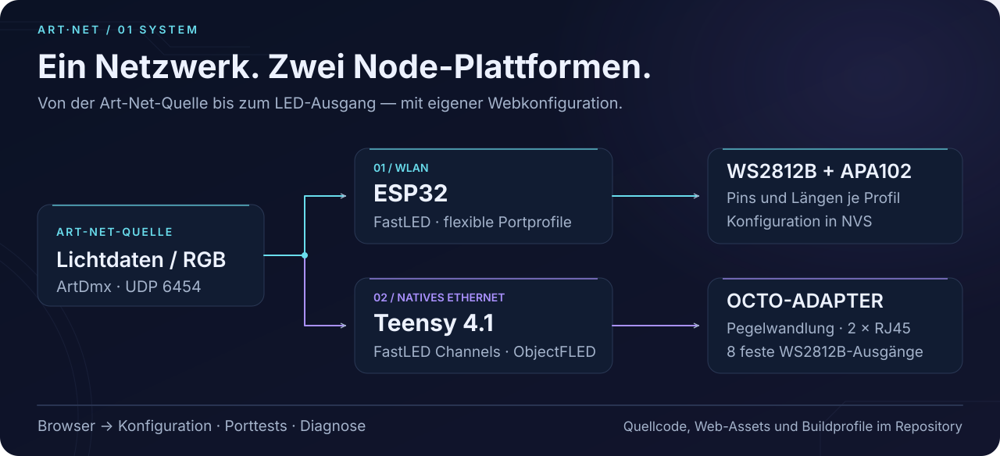
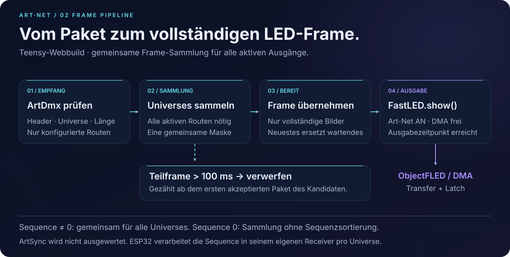
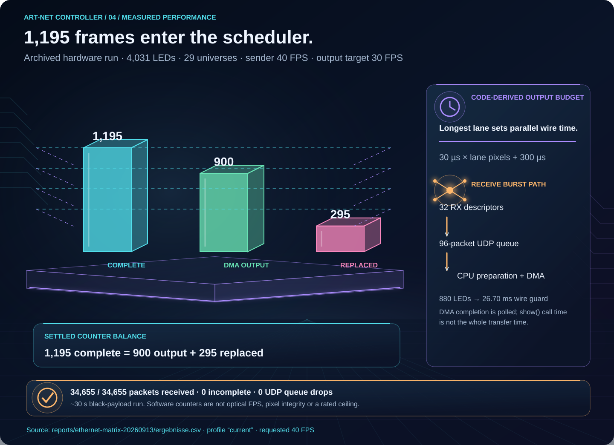
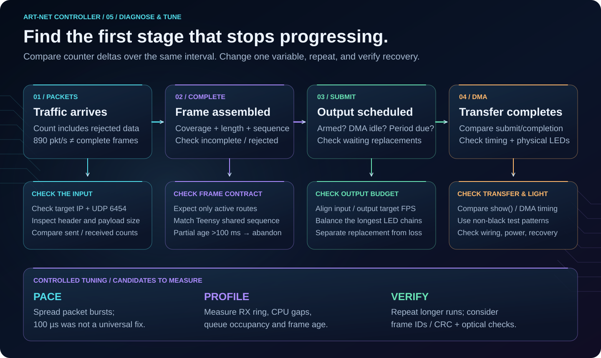
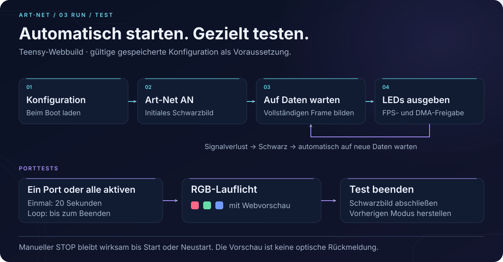

# Art-Net Controller

**Network data. Complete frames. Parallel light.**

ESP32 and Teensy 4.1 firmware, web interfaces, board profiles and build tools,
with source provenance and recorded verification results. The diagrams below
follow the implementation; measured results and proposed tuning are labelled
separately. Documentation updated **2 October 2026**.



| Node | Main build | LED output | Configuration |
|---|---|---|---|
| **ESP32** | `esp32-wifi-flex8` | FastLED; WS2812B / APA102; flexible ports | Web, NVS, application OTA |
| **Teensy 4.1 / Octo** | `teensy41_octo_web_rx32` | FastLED Channels / ObjectFLED; fixed Octo pins | Web, EEPROM, USB update |

The Teensy uses native Ethernet through a separate ribbon-connected module.
The existing Octo adapter provides level shifting and two LED RJ45 connectors;
the firmware does not use the OctoWS2811 library.

## Packets become frames



An ArtDmx packet carries one universe. Our Teensy receiver publishes a frame
only after **all active universe routes across the controller** are present.
Reserved gaps and disabled ports are excluded. Short final payloads are allowed
when they contain enough RGB bytes and use an even declared length.

The Teensy's shared non-zero sequence requirement is an implementation contract,
not a universal Art-Net frame definition. The ESP maintains sequence state per
universe. Neither of these receive paths implements ArtSync.

Read the [English packet, frame and output guide](docs/ARTNET_DATA_FLOW.md) for
sequence rules, timeouts, expected universes, source links and the distinction
between protocol rules and project behavior.

## Performance: follow the whole pipeline



In this archived run, all **34,655 packets** arrived, while the configured
30-FPS output limit replaced older waiting frames. Receive loss, incomplete
assembly and intentional frame replacement are different events.

Parallel output time depends on the **longest LED lane**. Universe count drives
packet load, while copying and synchronous `show()` preparation compete for CPU
time with network service. The measurements use black payloads and short runs;
DMA counters do not establish optical frame rate or long-term operating limits.

- [English bottleneck analysis and tuning workflow](docs/ARTNET_DATA_FLOW.md#performance-and-bottlenecks)
- [Full archived hardware report, including pacing comparisons (German)](reports/ethernet-matrix-20260913/BERICHT_DE.md)
- [Measured cases as CSV](reports/ethernet-matrix-20260913/ergebnisse.csv)

## Diagnose before tuning



**Packets/s alone cannot prove that complete frames exist.** Compare counter
deltas over the same interval, then inspect the first stage that stops advancing.
Check universe coverage, packet length and sequence before changing buffers.
Pacing, larger receive rings and reduced copying are candidates to measure;
they are not interchangeable fixes.

## Automatic start and port tests



With valid configuration, Teensy starts with **Art-Net ON**, waits for complete
data and automatically resumes after signal loss. A manual stop lasts until the
next start or reboot. RGB running-light tests support one port or all active
ports, once or in a loop. The web preview shows the commanded pattern and color;
physical LED inspection remains necessary.

The named profile `PJRC_OCTO_ADAPTER_T41` fixes OUT1–8 to
**2, 14, 7, 8, 6, 20, 21, 5**. Adapter model/revision, connector orientation and
physical output identification remain acceptance items. The historical pins
2–8 test profile must not be used as an RJ45 mapping.

- [Board profile](firmware/include/board_profiles/PjrcOctoAdapterT41.h)
- [Connector identification and parallel test procedure](docs/OCTO_ADAPTER_ABNAHME.md)
- [Output identification worksheet](reports/octo-output-identification.csv)

## Build from source

Run from the repository root in PowerShell. Both commands build locally:

```powershell
./firmware/teensy41_artnet/build.ps1 -NativeTests
./firmware/esp32_artnet/build.ps1 -Environments esp32-wifi-flex8 -FileSystem -NativeTests
```

Python, Node.js and a C++17 compiler for host tests are required. Add private Wi-Fi
credentials locally using the example header. Credentials are excluded from Git.

- [All 17 environments, dependencies and build verification](docs/NODE_BUILDS.md)
- [ESP32 source, build and SPIFFS assets](firmware/esp32_artnet/README.md)
- [Teensy build and dependencies](firmware/teensy41_artnet/README_DE.md)
- [Source provenance and import boundaries](docs/SOURCE_STATUS.md)
- [Build verification records](reports/build-verification-20261001)

## Graphics, configuration and evidence

The repository includes the [editable SVG diagrams](docs/assets/readme), their
[Python generator](tools/render_readme_diagrams.py), and all
[background concepts and original PNGs](output/imagegen/artnet-backgrounds).
Orbital Prism is included for [Teensy](firmware/teensy41_artnet/web/orbital-prism.webp)
and [ESP](firmware/esp32_artnet/web/assets/orbital-prism.webp), displayed at 50%
opacity. Teensy embeds the image in firmware; ESP serves it from SPIFFS.

Compiled defaults and saved device settings can differ. The last recorded
Teensy snapshot on **19 September 2026** had OUT6=610 and OUT7=512; compiled
defaults remain 536/512. The default 4,031-pixel map and that 4,105-pixel snapshot
both require 29 universes, but their final OUT6 payload requirements differ.
See the [receiver analysis and snapshot](docs/ARTNET_RECEIVER.md).

Historical source archives and reports are retained as evidence. Documentation
and successful builds do not imply a new live hardware or optical verification.
