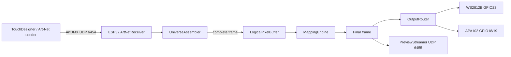
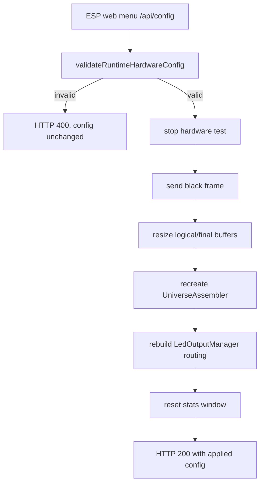

# Schrank LED Code Map

This document maps the main code areas so future changes can be reviewed and tested deliberately.

## Firmware

Firmware sources live in `firmware/include` and `firmware/src`.

| Area | Files | Responsibility | Key tests |
| --- | --- | --- | --- |
| Configuration | `ConfigManager.*`, `Types.h` | Default profiles, hardware validation, runtime limits | `tests/test_firmware_core.cpp` |
| Art-Net input | `ArtNetReceiver.*`, `UniverseAssembler.*` | Parse ArtDMX packets, assemble complete RGB frames | `tests/test_firmware_core.cpp`, `tests/test_hardware_benchmark_tool.js` |
| Pixel model | `LogicalPixelBuffer.*`, `MappingEngine.*`, `OutputRouter.*` | Logical frame storage, mapping, output slices | `tests/test_firmware_core.cpp`, `tests/test_mapping_schema.js` |
| LED output | `LedOutputs.*` | FastLED-backed WS2812B/APA102 adapters | `tests/test_firmware_core.cpp`, ESP monitor/hardware tests |
| ESP web API | `WebApi.*` | JSON endpoints and embedded web menu | `tests/test_firmware_core.cpp`, `tests/test_esp_web_menu_playwright.js` |
| Hardware test loop | `HardwareTest.*` | Low-power diagnostic chase patterns | `tests/test_firmware_core.cpp`, visual hardware confirmation |
| Network/preview | `NetworkManager.*`, `PreviewStreamer.*`, `PreviewProtocol.*` | WiFi/Ethernet setup and UDP preview frames | `tests/test_processing_protocol.js` |
| Performance | `Performance.*`, `PerformanceMonitor.*`, `SystemStats.h` | Timing estimates and runtime stats | `tests/test_firmware_core.cpp`, benchmarks |
| Arduino entrypoint | `main.cpp` | Boot, loop orchestration, runtime reconfigure callback | PlatformIO build and ESP monitor |

## Desktop/Web Tools

| Area | Files | Responsibility | Key tests |
| --- | --- | --- | --- |
| Browser UI | `web/index.html`, `web/app.js`, `web/styles.css`, `web/calculations.js` | Local controller planning UI and live status pages | `tests/test_web_calculations.js`, `tests/test_web_ui_playwright.js` |
| Player GUI | `web/player-control.html`, `tools/player-control-server.js`, `SchrankLED-Player-GUI*.cmd` | Windows-friendly FastLED sketch player controls | Manual playback tests |
| Art-Net tools | `tools/artnet-test-tool.js`, `tools/hardware-benchmark.js`, `tools/visualizer-test-patterns.js` | Packet generation, smoke tests, benchmarks | `tests/test_hardware_benchmark_tool.js`, hardware tests |
| Mapping tools | `tools/mapping-convert.js`, `tools/mapping-utils.js`, `config/examples/*` | Neutral mapping validation plus Pixelblaze and MariMapper import/export | `tests/test_mapping_schema.js` |
| Processing visualizer | `processing/*` | UDP preview and Art-Net visualization | `tests/test_processing_protocol.js`, `tests/test_processing_visualizer.js` |

## Runtime Data Flow

## Runtime Reconfigure Flow

## Supported ESP32 Runtime Hardware

The runtime UI is flexible inside the compiled hardware adapters. Free arbitrary GPIO switching is not supported by this firmware profile because FastLED controller templates are bound at compile time.

| Output | Type | GPIO | Color order | Runtime pixel limit |
| --- | --- | --- | --- | --- |
| 0 | WS2812B | Data GPIO23 | GRB | 1024 |
| 1 | APA102 | Data GPIO18, Clock GPIO19 | BGR | 1200 |

Current verified default:

- WS2812B: 512 LEDs, start pixel 0.
- APA102: 1167 LEDs, start pixel 512.
- Total: 1679 pixels, 10 Art-Net universes.
