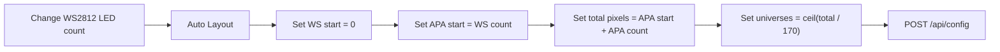
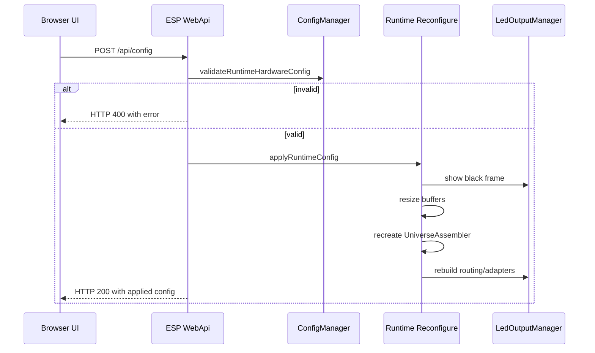

# ESP32 Web Menu and Runtime Configuration

Aktualisierung 2026-09-07: Die folgende Beschreibung dokumentiert den frueheren
Stand. Gemeinsame Weboberflaeche, gehaltenes Blackout und explizite NVS-Speicherung
sind in [Controller refresh](CONTROLLER_REFRESH.md) beschrieben. Den aktuellen
Hardware-Verifikationsstand enthaelt [STATUS.md](../STATUS.md).

The ESP32 firmware serves its own web menu at:

- `http://10.0.0.251/`
- `http://10.0.0.251/live`

The page is embedded in `firmware/src/WebApi.cpp`, so no external assets or internet connection are required.


## What the Menu Can Do

- Show live ESP status: pixels, FPS, Art-Net frames, heap and output table.
- Start/stop the low-power hardware test loop.
- Set the Processing/preview UDP target.
- Reboot the ESP.
- Apply runtime configuration changes in RAM.
- Auto-layout outputs when LED counts change.

Changes are currently RAM-only. After a reboot, the compiled firmware profile is loaded again.

## Current Hardware Profile

| Output | Type | Pins | Color order | Default LEDs | Runtime max |
| --- | --- | --- | --- | ---: | ---: |
| 0 | WS2812B | Data GPIO23 | GRB | 512 | 1024 |
| 1 | APA102 | Data GPIO18, Clock GPIO19 | BGR | 1167 | 1200 |

Default layout:

| Field | Value |
| --- | ---: |
| Total pixels | 1679 |
| Art-Net start universe | 0 |
| Universe count | 10 |
| Target FPS | 30 |

## Auto Layout

When a chain length changes, the downstream output start pixel and total pixel count must be updated too.

Example: changing WS2812B from 512 to 712 LEDs.

| Output | Old start | Old LEDs | New start | New LEDs |
| --- | ---: | ---: | ---: | ---: |
| WS2812B | 0 | 512 | 0 | 712 |
| APA102 | 512 | 1167 | 712 | 1167 |

New total:

```text
712 + 1167 = 1879 pixels
ceil(1879 / 170) = 12 Art-Net universes
```

The web menu performs this normalization automatically on `Apply`. The `Auto Layout` button lets you preview the recalculated values before applying.



## API Endpoints

| Endpoint | Method | Purpose |
| --- | --- | --- |
| `/` | GET | Web menu |
| `/live` | GET | Same web menu |
| `/api/status` | GET | Runtime status and performance counters |
| `/api/config` | GET | Full runtime configuration |
| `/api/config` | POST | Apply a validated runtime configuration |
| `/api/outputs` | GET | Output list |
| `/api/outputs` | POST | Apply output list through same validation path |
| `/api/test-pattern` | GET | Hardware test state |
| `/api/test-pattern` | POST | Start, loop or stop hardware tests |
| `/api/preview/target` | POST | Set preview target host/port |
| `/api/reboot` | POST | Restart ESP32 |

## Apply Safety

The ESP rejects unsupported hardware combinations with HTTP 400. This prevents the UI from claiming a pin or color order changed when the compiled FastLED adapter cannot actually drive it.

Accepted hardware values:

- WS2812B output must be `id=0`, `dataPin=23`, `clockPin=-1`, `colorOrder=GRB`, `spiHz=0`, `pixelCount<=1024`.
- APA102 output must be `id=1`, `dataPin=18`, `clockPin=19`, `colorOrder=BGR`, `spiHz=4000000`, `pixelCount<=1200`.
- Total `pixelCount` must be `<=2400`.
- `targetFps` must be `1..60`.

## What Happens on Apply



## TouchDesigner / Art-Net Settings

Use the ESP as an Art-Net target:

| Setting | Value |
| --- | --- |
| Target IP | `10.0.0.251` |
| UDP port | `6454` |
| Start universe | `0` |
| Universe size | 510 RGB channels / 170 pixels |
| Default universe range | `0..9` |
| 1879-pixel example range | `0..11` |

Stop the internal test loop before sending live Art-Net:

```sh
curl -X POST http://10.0.0.251/api/test-pattern \
  -H "Content-Type: application/json" \
  -d "{\"action\":\"stop\"}"
```
