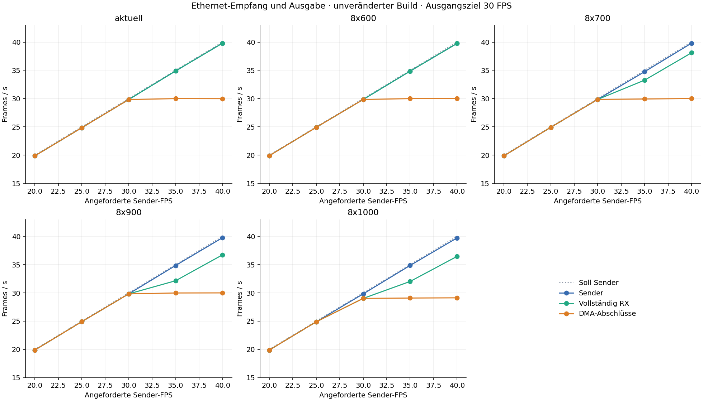
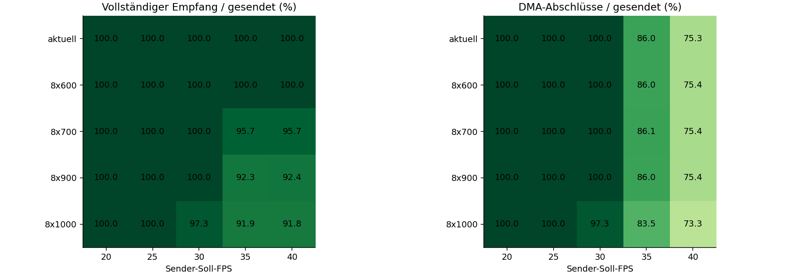
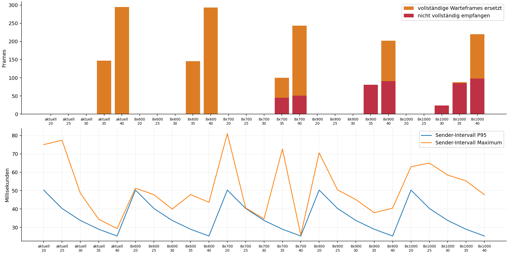
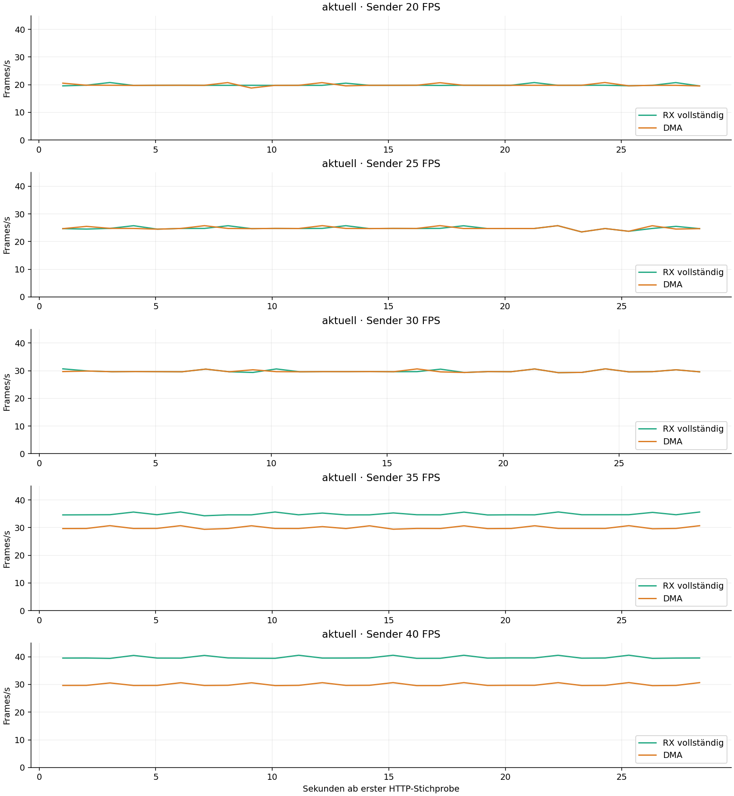
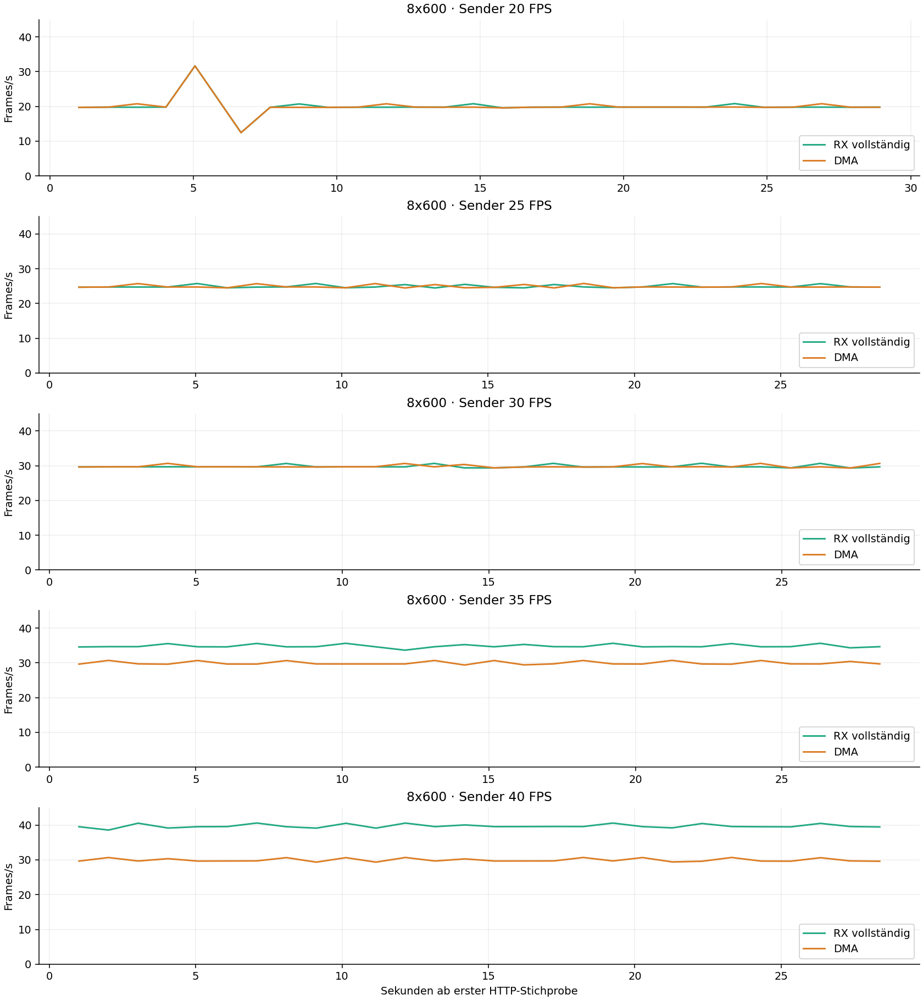
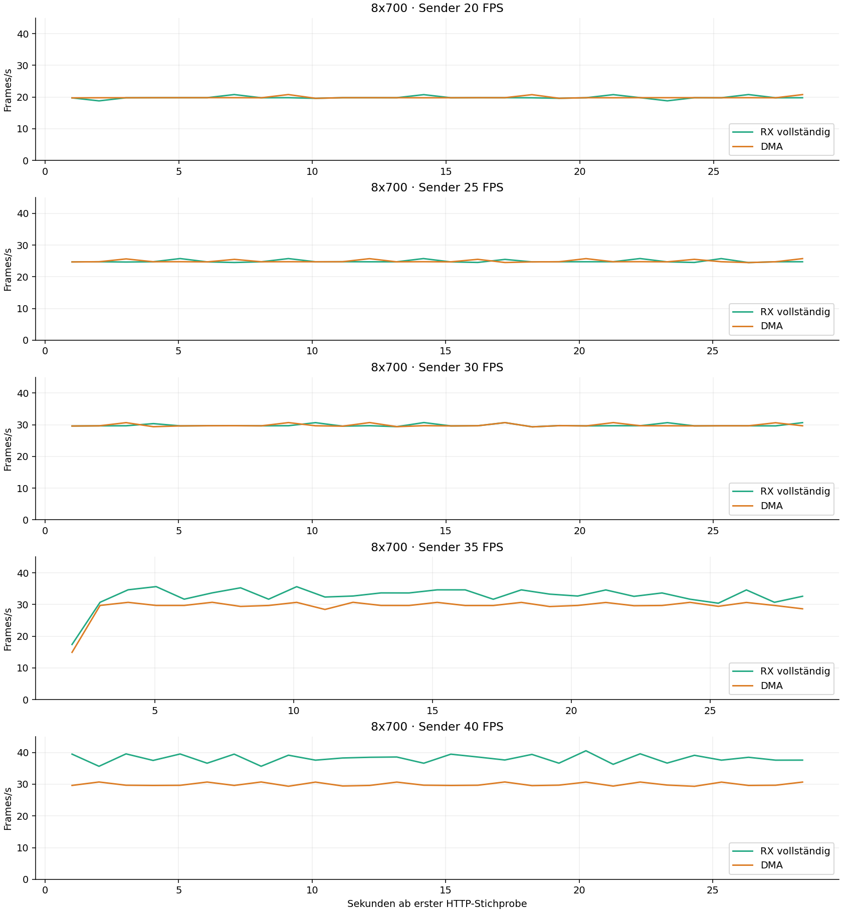
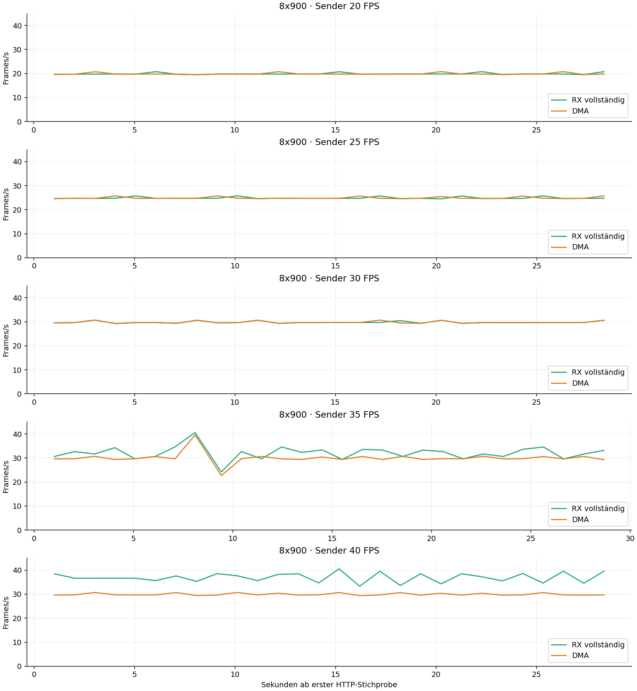
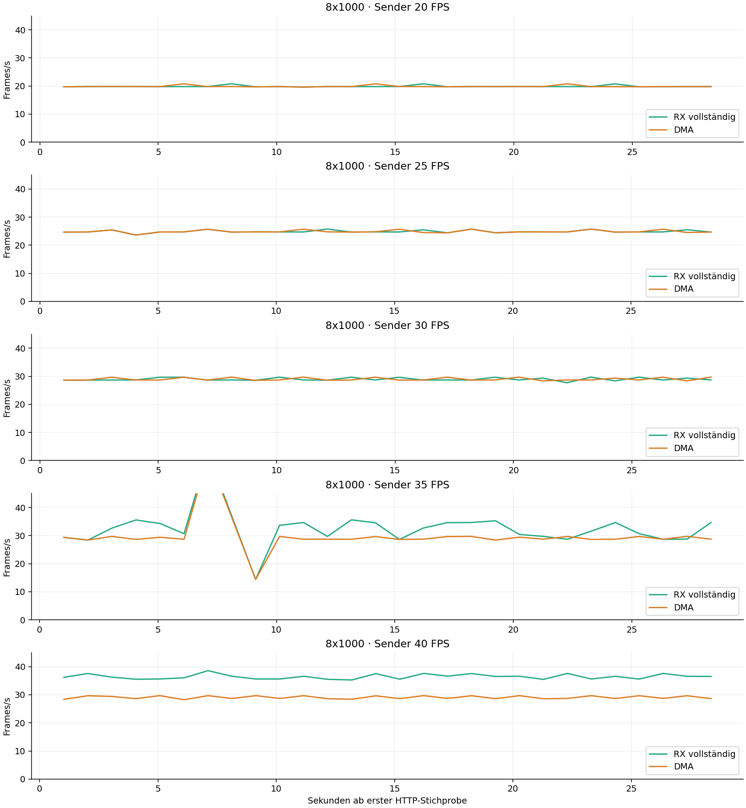
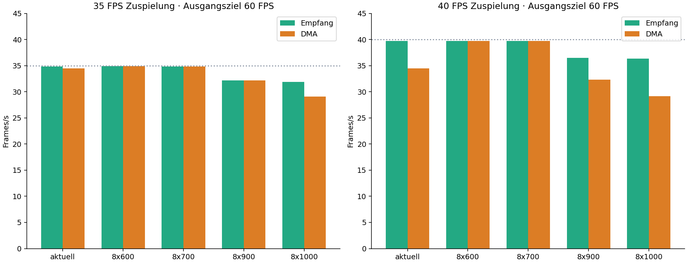
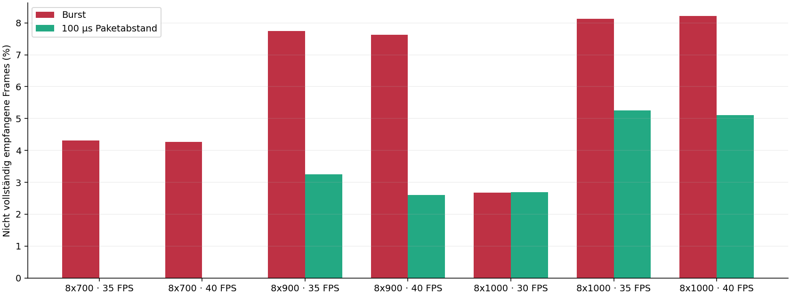

# Teensy Ethernet-Testbericht – 13.09.2026

Gemessener Build: `orbital-port-tests-20260913`. 25 Lastfälle à ungefähr 30 Sekunden; insgesamt 22,395 gesendete und 21,920 vollständig empfangene Frames. Die folgenden Aussagen betreffen genau diese Messungen, keine Hochrechnung auf einen Dauerbetrieb.

**Hauptreihe: 18/25 Empfangsfälle vollständig bestanden. 475 Frames wurden nicht vollständig empfangen; 4302 gesendete Pakete fehlen in den Receiver-Zählern.** Die bewusst ersetzten Komplettbilder werden separat gezählt. Danach folgen die Zusatzreihe mit angehobenem Ausgangsziel und der gezielte Paketverteilungs-Vergleich, jeweils mit eigenen Rohdaten und Einzelbewertungen.

## Ergebnis für die Anwendung

Der vollständige Bericht enthält **42 Lastläufe**, entsprechend **21.0 Minuten nominaler Ethernet-Zuspielung**, zuzüglich Konfigurationswechseln und **13** absichtlichen Teilbild-/Recovery-Prüfungen. Jede Reihe bleibt getrennt: Hauptreihe = bestehendes 30-FPS-Ziel; Kapazität = 60-FPS-Ziel; Paketverteilung = 30-FPS-Ziel mit 100 µs Sendeabstand.

| Profil | Höchste getestete Sollrate mit allen Frames bis DMA | Dabei verwendetes Ausgangsziel | Gemessene DMA-FPS |
|---|---:|---:|---:|
| aktuell | 30 | 30 | 29.832 |
| 8x600 | 40 | 60 | 39.739 |
| 8x700 | 40 | 60 | 39.738 |
| 8x900 | 30 | 30 | 29.823 |
| 8x1000 | 25 | 30 | 24.889 |

Diese Tabelle nennt bestandene einzelne Testfälle, keine garantierten Dauerbetriebsgrenzen. Besonders bei 8 × 700 ist die Ausgangseinstellung entscheidend: Ein bestandener 40-FPS-Lauf mit 60-FPS-Ausgangsziel hebt einen fehlerhaften Burstlauf mit 30-FPS-Ausgangsziel nicht auf. Für 8 × 1000 ist 25 FPS die höchste hier vollständig bis DMA bestandene Sollrate; ein höherer Empfangsdurchsatz allein macht daraus keine höhere vollständige Ausgaberate.

## Testaufbau und Aussagekraft

Der Windows-Rechner sendete ArtDmx-Unicast auf UDP 6454 an 10.0.0.253. Der lokale Socket und die Ethernet-Route sind in den Rohdaten dokumentiert. Der Teensy bestätigte den Empfang über seine eigenen HTTP-Zähler. Es handelt sich um reale Netzwerkübertragung und reale FastLED-/ObjectFLED-DMA-Aufrufe. TouchDesigner war nicht die Quelle.

Die Firmware wurde weder geändert noch neu geflasht. Die Buildkennung wurde vor dem Test geprüft. Lokale HEX-/Quellhashes liegen bei; eine aus dem Gerät zurückgelesene Binäridentität wurde nicht ermittelt. Für jede geänderte Portlänge wurde die Konfiguration gespeichert und der Controller neu gestartet, weil die initialisierten LED-Kanäle strukturelle Änderungen erst danach übernehmen.

Alle Profile behielten 30 Ziel-FPS, Helligkeit 8/255, WS2812B und die vorhandene Farbreihenfolge. 35/40 FPS sind in dieser Hauptreihe Eingangsbelastungen; sie sind keine Anforderung an einen auf 30 FPS begrenzten Ausgang. Die acht Pins bleiben 2,14,7,8,6,20,21,5.

Je Universum wurden 510 RGB-Nutzbytes gesendet, auch wenn die letzte Teilstrecke weniger benötigt. Die Nutzdaten waren schwarz. Das beansprucht dieselbe Paketgröße und den DMA-Ausgabepfad, prüft aber keine Farbabhängigkeiten, Verkabelung, Stromversorgung unter Weißlast oder sichtbare Pixelkorrektheit. Die Sequenznummer 1–255 wechselte pro Frame und war innerhalb eines Frames für alle Universen gleich.

Der Sender wartet auf den nächsten Termin und holt Verzögerungen nicht mit Frame-Bursts nach. Windows-Scheduling führt deshalb zu leicht niedrigeren Ist-FPS. Als Verlustbasis gilt ausschließlich die tatsächlich erfolgreich an den UDP-Socket übergebene Paket-/Framezahl. UDP-send allein beweist keinen Empfang; diesen belegt der Vergleich mit den unabhängigen Geräte-Zählern. Die Schleife läuft mindestens 30 Sekunden, das letzte Warten kann die Dauer geringfügig verlängern.

HTTP-Status wurde etwa einmal pro Sekunde parallel erfasst. Vorher-/Nachher-Snapshots begrenzen jeden Fall. Nach Sendeende gab es 150 ms Auslauf für das letzte DMA, bevor der Abschlussstatus gelesen wurde. Die daraus berechnete DMA-Rate ist der Durchsatz der zugespielten Testmenge einschließlich abgearbeiteter Restframes, keine exakt zeitgestempelte physische Bildrate.

## Zähler richtig lesen

| Größe | Bedeutung |
|---|---|
| Vollständige Frames | Alle konfigurierten Universen einer Sequenz im Receiver vorhanden. |
| Teilbilder | Begonnener Universensatz durch Timeout/Sequenzwechsel aufgegeben. |
| Queue-Drops | Vom UDP-Socket gemeldete Überläufe; keine vollständige PHY-Verluststatistik. |
| Ersetzt | Vollständiges wartendes Bild durch ein neueres ersetzt, bevor es zur Ausgabe genommen wurde. |
| Submit | FastLED.show für ein Bild gestartet. |
| DMA-Abschluss | Firmware hat das Ende des Transfers einschließlich eigener Wartebedingungen beobachtet. |
| Show-Zeit | Dauer von FastLED.show, nicht identisch mit der gesamten LED-Datenzeit. |

Die Frame-Vollständigkeit ist eine Protokollprüfung anhand der Universenmaske. Der Build bietet keine Rückgabe des Framebuffers oder CRC des empfangenen Pixelbildes. Eine bytegenaue Ende-zu-Ende-Integritätsaussage ist daher nicht möglich. `physical_fps_verified` bleibt false. Selbst 100 % empfangene Universensätze sind kein optischer Beweis.

## Konfigurationen und Belastung

| Profil | LEDs | Universen/Frame | Längste Kette | LED-Zeit + 0,3 ms Reserve | ArtDmx bei 40 FPS |
|---|---:|---:|---:|---:|---:|
| aktuell | 4031 | 29 | 880 | 26.70 ms | 1160 Pakete/s · 4.90 Mbit/s |
| 8x600 | 4800 | 32 | 600 | 18.30 ms | 1280 Pakete/s · 5.41 Mbit/s |
| 8x700 | 5600 | 40 | 700 | 21.30 ms | 1600 Pakete/s · 6.76 Mbit/s |
| 8x900 | 7200 | 48 | 900 | 27.30 ms | 1920 Pakete/s · 8.11 Mbit/s |
| 8x1000 | 8000 | 48 | 1000 | 30.30 ms | 1920 Pakete/s · 8.11 Mbit/s |

Die Startuniversen der zusätzlichen Profile wurden ab U120 fortlaufend und ohne Überlappung vergeben. Alle acht Ports waren jeweils aktiviert. Universen sind 0-basiert angegeben.

| Profil | OUT1 | OUT2 | OUT3 | OUT4 | OUT5 | OUT6 | OUT7 | OUT8 |
|---|---|---|---|---|---|---|---|---|
| aktuell | 203 LEDs / U120–121 | 738 LEDs / U122–126 | 880 LEDs / U127–132 | 810 LEDs / U133–137 | 352 LEDs / U139–141 | 536 LEDs / U142–145 | 512 LEDs / U146–149 | deaktiviert |
| 8x600 | 600 LEDs / U120–123 | 600 LEDs / U124–127 | 600 LEDs / U128–131 | 600 LEDs / U132–135 | 600 LEDs / U136–139 | 600 LEDs / U140–143 | 600 LEDs / U144–147 | 600 LEDs / U148–151 |
| 8x700 | 700 LEDs / U120–124 | 700 LEDs / U125–129 | 700 LEDs / U130–134 | 700 LEDs / U135–139 | 700 LEDs / U140–144 | 700 LEDs / U145–149 | 700 LEDs / U150–154 | 700 LEDs / U155–159 |
| 8x900 | 900 LEDs / U120–125 | 900 LEDs / U126–131 | 900 LEDs / U132–137 | 900 LEDs / U138–143 | 900 LEDs / U144–149 | 900 LEDs / U150–155 | 900 LEDs / U156–161 | 900 LEDs / U162–167 |
| 8x1000 | 1000 LEDs / U120–125 | 1000 LEDs / U126–131 | 1000 LEDs / U132–137 | 1000 LEDs / U138–143 | 1000 LEDs / U144–149 | 1000 LEDs / U150–155 | 1000 LEDs / U156–161 | 1000 LEDs / U162–167 |

Bandbreite oben zählt den 18-Byte-ArtDmx-Header plus 510 Nutzbytes, ohne UDP/IP/Ethernet. Mit 66 Byte zusätzlichem IPv4/Ethernet-Aufwand einschließlich Präambel und Paketabstand liegt das Maximum von 48 Universen bei 40 FPS rechnerisch bei etwa 9,12 Mbit/s. Teensy 4.1 besitzt 10/100-Mbit-Ethernet ([PJRC](https://www.pjrc.com/store/teensy41.html)); die tatsächlich ausgehandelte Teensy-Linkrate wird von dieser API nicht gemeldet. Die Host-Linkrate allein beweist keine 100-Mbit-Verbindung am Teensy.

Die Zeitformel 30 µs je Pixel + 300 µs Reserve stammt aus dem getesteten Firmwarecode. Acht Ausgänge werden parallel betrieben: Entscheidend für die Drahtzeit ist die längste Kette. Speicherarbeit und Paketanzahl wachsen trotzdem mit der Gesamtpixelzahl. ObjectFLED beschreibt diesen parallelen DMA-Ansatz in seiner [Primärdokumentation](https://github.com/KurtMF/ObjectFLED).

## Gesamtvergleich

| Profil | Soll | Ist Sender | RX FPS | DMA FPS | Frames gesendet/RX | Fehlend | Ersetzt | RX vollständig |
|---|---:|---:|---:|---:|---:|---:|---:|---:|
| aktuell | 20 | 19.870 | 19.870 | 19.870 | 597/597 | 0 | 0 | 100.00 % |
| aktuell | 25 | 24.845 | 24.845 | 24.845 | 746/746 | 0 | 0 | 100.00 % |
| aktuell | 30 | 29.832 | 29.832 | 29.832 | 895/895 | 0 | 0 | 100.00 % |
| aktuell | 35 | 34.892 | 34.892 | 29.993 | 1047/1047 | 0 | 147 | 100.00 % |
| aktuell | 40 | 39.808 | 39.808 | 29.981 | 1195/1195 | 0 | 295 | 100.00 % |
| 8x600 | 20 | 19.907 | 19.907 | 19.907 | 598/598 | 0 | 0 | 100.00 % |
| 8x600 | 25 | 24.916 | 24.916 | 24.916 | 748/748 | 0 | 0 | 100.00 % |
| 8x600 | 30 | 29.844 | 29.844 | 29.844 | 896/896 | 0 | 0 | 100.00 % |
| 8x600 | 35 | 34.857 | 34.857 | 29.992 | 1046/1046 | 0 | 146 | 100.00 % |
| 8x600 | 40 | 39.757 | 39.757 | 29.993 | 1193/1193 | 0 | 293 | 100.00 % |
| 8x700 | 20 | 19.858 | 19.858 | 19.858 | 596/596 | 0 | 0 | 100.00 % |
| 8x700 | 25 | 24.918 | 24.918 | 24.918 | 748/748 | 0 | 0 | 100.00 % |
| 8x700 | 30 | 29.855 | 29.855 | 29.855 | 896/896 | 0 | 0 | 100.00 % |
| 8x700 | 35 | 34.761 | 33.262 | 29.929 | 1043/998 | 45 | 100 | 95.69 % |
| 8x700 | 40 | 39.800 | 38.102 | 30.009 | 1195/1144 | 51 | 243 | 95.73 % |
| 8x900 | 20 | 19.890 | 19.890 | 19.890 | 597/597 | 0 | 0 | 100.00 % |
| 8x900 | 25 | 24.906 | 24.906 | 24.906 | 748/748 | 0 | 0 | 100.00 % |
| 8x900 | 30 | 29.823 | 29.823 | 29.823 | 895/895 | 0 | 0 | 100.00 % |
| 8x900 | 35 | 34.847 | 32.148 | 29.983 | 1046/965 | 81 | 65 | 92.26 % |
| 8x900 | 40 | 39.764 | 36.731 | 29.998 | 1193/1102 | 91 | 202 | 92.37 % |
| 8x1000 | 20 | 19.896 | 19.896 | 19.896 | 597/597 | 0 | 0 | 100.00 % |
| 8x1000 | 25 | 24.889 | 24.889 | 24.889 | 747/747 | 0 | 0 | 100.00 % |
| 8x1000 | 30 | 29.824 | 29.025 | 29.025 | 895/871 | 24 | 0 | 97.32 % |
| 8x1000 | 35 | 34.853 | 32.021 | 29.089 | 1046/961 | 85 | 88 | 91.87 % |
| 8x1000 | 40 | 39.721 | 36.455 | 29.124 | 1192/1094 | 98 | 220 | 91.78 % |

## Jeder Testfall im Detail

### Profil aktuell

Die Kurven sind Differenzen kumulativer Geräte-Zähler zwischen HTTP-Abfragen. Auflösung ungefähr eine Sekunde; einzelne Spitzen können durch Messfenster/Antwortzeit entstehen und sind keine pro-Frame-Latenzmessung.

#### 20 FPS Zuspielung

Messdauer **30.0455 s**. Gesendet wurden **597 Frames / 17313 Pakete** bei **19.870 FPS**. Der Teensy zählte **17313 Pakete / 597 vollständige Frames**: **100.000 %** der tatsächlich gesendeten Bilder. Gegenüber dem Soll liegt der Sender um 0.65 % niedriger.

Ausgabe: **597 Submits**, **597 DMA-Abschlüsse**, entsprechend **19.870 FPS** und **100.00 %** der eingespeisten Bilder. **0** vollständige Warteframes wurden ersetzt. Die Bilanz vollständig − Submit − ersetzt ist **0**; null bedeutet, dass kein empfangenes Komplettbild in dieser Bilanz unerklärt bleibt. Blackout-Submits im Messfenster: 0.

Fehlerzähler: fehlende Pakete **0**, fehlende Komplettbilder **0**, Teilbilder **0**, UDP-Queue-Drops **0**, abgewiesen **0**, ignoriert **0**, veraltet **0**, Duplikate **0**. HTTP-Abfragefehler: **0**.

Sendetakt: Intervall-Median **50.247 ms**, P95 **50.303 ms**, Maximum **75.056 ms**; nominal 50.000 ms. P95 der Paket-Burstdauer pro Frame: **0.433 ms**. Längste beobachtete HTTP-Antwort: **22.605 ms**.

In den Einsekunden-Stichproben: höchste aktuelle Show-Zeit **2.188 ms**, höchste aktuelle beobachtete DMA-Dauer **28.954 ms**. Dies sind Stichprobenmaxima; kurze Spitzen dazwischen können fehlen. Firmware-Maximalzähler im Rohprotokoll laufen seit Neustart und dürfen nicht als individuelle Fallmaxima gelesen werden.

**Bewertung:** In diesem Fall wurden alle gesendeten Frames vollständig empfangen; es wurden keine wartenden Komplettbilder ersetzt. Stimmen Submit- und DMA-Zahl mit der Empfangszahl überein, wurde jedes Bild auch durch den beobachteten Ausgabepfad abgearbeitet.

#### 25 FPS Zuspielung

Messdauer **30.0263 s**. Gesendet wurden **746 Frames / 21634 Pakete** bei **24.845 FPS**. Der Teensy zählte **21634 Pakete / 746 vollständige Frames**: **100.000 %** der tatsächlich gesendeten Bilder. Gegenüber dem Soll liegt der Sender um 0.62 % niedriger.

Ausgabe: **746 Submits**, **746 DMA-Abschlüsse**, entsprechend **24.845 FPS** und **100.00 %** der eingespeisten Bilder. **0** vollständige Warteframes wurden ersetzt. Die Bilanz vollständig − Submit − ersetzt ist **0**; null bedeutet, dass kein empfangenes Komplettbild in dieser Bilanz unerklärt bleibt. Blackout-Submits im Messfenster: 0.

Fehlerzähler: fehlende Pakete **0**, fehlende Komplettbilder **0**, Teilbilder **0**, UDP-Queue-Drops **0**, abgewiesen **0**, ignoriert **0**, veraltet **0**, Duplikate **0**. HTTP-Abfragefehler: **0**.

Sendetakt: Intervall-Median **40.033 ms**, P95 **40.293 ms**, Maximum **77.444 ms**; nominal 40.000 ms. P95 der Paket-Burstdauer pro Frame: **0.424 ms**. Längste beobachtete HTTP-Antwort: **21.868 ms**.

In den Einsekunden-Stichproben: höchste aktuelle Show-Zeit **2.190 ms**, höchste aktuelle beobachtete DMA-Dauer **28.960 ms**. Dies sind Stichprobenmaxima; kurze Spitzen dazwischen können fehlen. Firmware-Maximalzähler im Rohprotokoll laufen seit Neustart und dürfen nicht als individuelle Fallmaxima gelesen werden.

**Bewertung:** In diesem Fall wurden alle gesendeten Frames vollständig empfangen; es wurden keine wartenden Komplettbilder ersetzt. Stimmen Submit- und DMA-Zahl mit der Empfangszahl überein, wurde jedes Bild auch durch den beobachteten Ausgabepfad abgearbeitet.

#### 30 FPS Zuspielung

Messdauer **30.0011 s**. Gesendet wurden **895 Frames / 25955 Pakete** bei **29.832 FPS**. Der Teensy zählte **25955 Pakete / 895 vollständige Frames**: **100.000 %** der tatsächlich gesendeten Bilder. Gegenüber dem Soll liegt der Sender um 0.56 % niedriger.

Ausgabe: **895 Submits**, **895 DMA-Abschlüsse**, entsprechend **29.832 FPS** und **100.00 %** der eingespeisten Bilder. **0** vollständige Warteframes wurden ersetzt. Die Bilanz vollständig − Submit − ersetzt ist **0**; null bedeutet, dass kein empfangenes Komplettbild in dieser Bilanz unerklärt bleibt. Blackout-Submits im Messfenster: 0.

Fehlerzähler: fehlende Pakete **0**, fehlende Komplettbilder **0**, Teilbilder **0**, UDP-Queue-Drops **0**, abgewiesen **0**, ignoriert **0**, veraltet **0**, Duplikate **0**. HTTP-Abfragefehler: **0**.

Sendetakt: Intervall-Median **33.427 ms**, P95 **33.761 ms**, Maximum **48.562 ms**; nominal 33.333 ms. P95 der Paket-Burstdauer pro Frame: **0.418 ms**. Längste beobachtete HTTP-Antwort: **104.063 ms**.

In den Einsekunden-Stichproben: höchste aktuelle Show-Zeit **2.186 ms**, höchste aktuelle beobachtete DMA-Dauer **28.957 ms**. Dies sind Stichprobenmaxima; kurze Spitzen dazwischen können fehlen. Firmware-Maximalzähler im Rohprotokoll laufen seit Neustart und dürfen nicht als individuelle Fallmaxima gelesen werden.

**Bewertung:** In diesem Fall wurden alle gesendeten Frames vollständig empfangen; es wurden keine wartenden Komplettbilder ersetzt. Stimmen Submit- und DMA-Zahl mit der Empfangszahl überein, wurde jedes Bild auch durch den beobachteten Ausgabepfad abgearbeitet.

#### 35 FPS Zuspielung

Messdauer **30.0071 s**. Gesendet wurden **1047 Frames / 30363 Pakete** bei **34.892 FPS**. Der Teensy zählte **30363 Pakete / 1047 vollständige Frames**: **100.000 %** der tatsächlich gesendeten Bilder. Gegenüber dem Soll liegt der Sender um 0.31 % niedriger.

Ausgabe: **900 Submits**, **900 DMA-Abschlüsse**, entsprechend **29.993 FPS** und **85.96 %** der eingespeisten Bilder. **147** vollständige Warteframes wurden ersetzt. Die Bilanz vollständig − Submit − ersetzt ist **0**; null bedeutet, dass kein empfangenes Komplettbild in dieser Bilanz unerklärt bleibt. Blackout-Submits im Messfenster: 0.

Fehlerzähler: fehlende Pakete **0**, fehlende Komplettbilder **0**, Teilbilder **0**, UDP-Queue-Drops **0**, abgewiesen **0**, ignoriert **0**, veraltet **0**, Duplikate **0**. HTTP-Abfragefehler: **0**.

Sendetakt: Intervall-Median **28.572 ms**, P95 **28.970 ms**, Maximum **34.405 ms**; nominal 28.571 ms. P95 der Paket-Burstdauer pro Frame: **0.398 ms**. Längste beobachtete HTTP-Antwort: **21.891 ms**.

In den Einsekunden-Stichproben: höchste aktuelle Show-Zeit **2.191 ms**, höchste aktuelle beobachtete DMA-Dauer **28.961 ms**. Dies sind Stichprobenmaxima; kurze Spitzen dazwischen können fehlen. Firmware-Maximalzähler im Rohprotokoll laufen seit Neustart und dürfen nicht als individuelle Fallmaxima gelesen werden.

**Bewertung:** Alle gesendeten Bilder kamen vollständig an. Ein Teil wurde vor der Ausgabe bewusst durch neuere vollständige Bilder ersetzt. Damit ist der Engpass dieser Messung im Ausgabetakt bzw. dessen Verarbeitung zu suchen; die Differenz ist kein Ethernet-Paketverlust. Das Verfahren priorisiert Aktualität und verhindert eine anwachsende Warteschlange.

#### 40 FPS Zuspielung

Messdauer **30.0193 s**. Gesendet wurden **1195 Frames / 34655 Pakete** bei **39.808 FPS**. Der Teensy zählte **34655 Pakete / 1195 vollständige Frames**: **100.000 %** der tatsächlich gesendeten Bilder. Gegenüber dem Soll liegt der Sender um 0.48 % niedriger.

Ausgabe: **900 Submits**, **900 DMA-Abschlüsse**, entsprechend **29.981 FPS** und **75.31 %** der eingespeisten Bilder. **295** vollständige Warteframes wurden ersetzt. Die Bilanz vollständig − Submit − ersetzt ist **0**; null bedeutet, dass kein empfangenes Komplettbild in dieser Bilanz unerklärt bleibt. Blackout-Submits im Messfenster: 0.

Fehlerzähler: fehlende Pakete **0**, fehlende Komplettbilder **0**, Teilbilder **0**, UDP-Queue-Drops **0**, abgewiesen **0**, ignoriert **0**, veraltet **0**, Duplikate **0**. HTTP-Abfragefehler: **0**.

Sendetakt: Intervall-Median **25.010 ms**, P95 **25.288 ms**, Maximum **29.325 ms**; nominal 25.000 ms. P95 der Paket-Burstdauer pro Frame: **0.388 ms**. Längste beobachtete HTTP-Antwort: **14.592 ms**.

In den Einsekunden-Stichproben: höchste aktuelle Show-Zeit **2.197 ms**, höchste aktuelle beobachtete DMA-Dauer **29.383 ms**. Dies sind Stichprobenmaxima; kurze Spitzen dazwischen können fehlen. Firmware-Maximalzähler im Rohprotokoll laufen seit Neustart und dürfen nicht als individuelle Fallmaxima gelesen werden.

**Bewertung:** Alle gesendeten Bilder kamen vollständig an. Ein Teil wurde vor der Ausgabe bewusst durch neuere vollständige Bilder ersetzt. Damit ist der Engpass dieser Messung im Ausgabetakt bzw. dessen Verarbeitung zu suchen; die Differenz ist kein Ethernet-Paketverlust. Das Verfahren priorisiert Aktualität und verhindert eine anwachsende Warteschlange.

### Profil 8x600

Die Kurven sind Differenzen kumulativer Geräte-Zähler zwischen HTTP-Abfragen. Auflösung ungefähr eine Sekunde; einzelne Spitzen können durch Messfenster/Antwortzeit entstehen und sind keine pro-Frame-Latenzmessung.

#### 20 FPS Zuspielung

Messdauer **30.0404 s**. Gesendet wurden **598 Frames / 19136 Pakete** bei **19.907 FPS**. Der Teensy zählte **19136 Pakete / 598 vollständige Frames**: **100.000 %** der tatsächlich gesendeten Bilder. Gegenüber dem Soll liegt der Sender um 0.47 % niedriger.

Ausgabe: **598 Submits**, **598 DMA-Abschlüsse**, entsprechend **19.907 FPS** und **100.00 %** der eingespeisten Bilder. **0** vollständige Warteframes wurden ersetzt. Die Bilanz vollständig − Submit − ersetzt ist **0**; null bedeutet, dass kein empfangenes Komplettbild in dieser Bilanz unerklärt bleibt. Blackout-Submits im Messfenster: 0.

Fehlerzähler: fehlende Pakete **0**, fehlende Komplettbilder **0**, Teilbilder **0**, UDP-Queue-Drops **0**, abgewiesen **0**, ignoriert **0**, veraltet **0**, Duplikate **0**. HTTP-Abfragefehler: **0**.

Sendetakt: Intervall-Median **50.247 ms**, P95 **50.296 ms**, Maximum **51.338 ms**; nominal 50.000 ms. P95 der Paket-Burstdauer pro Frame: **0.443 ms**. Längste beobachtete HTTP-Antwort: **605.808 ms**.

In den Einsekunden-Stichproben: höchste aktuelle Show-Zeit **2.389 ms**, höchste aktuelle beobachtete DMA-Dauer **21.142 ms**. Dies sind Stichprobenmaxima; kurze Spitzen dazwischen können fehlen. Firmware-Maximalzähler im Rohprotokoll laufen seit Neustart und dürfen nicht als individuelle Fallmaxima gelesen werden.

**Bewertung:** In diesem Fall wurden alle gesendeten Frames vollständig empfangen; es wurden keine wartenden Komplettbilder ersetzt. Stimmen Submit- und DMA-Zahl mit der Empfangszahl überein, wurde jedes Bild auch durch den beobachteten Ausgabepfad abgearbeitet.

#### 25 FPS Zuspielung

Messdauer **30.0211 s**. Gesendet wurden **748 Frames / 23936 Pakete** bei **24.916 FPS**. Der Teensy zählte **23936 Pakete / 748 vollständige Frames**: **100.000 %** der tatsächlich gesendeten Bilder. Gegenüber dem Soll liegt der Sender um 0.34 % niedriger.

Ausgabe: **748 Submits**, **748 DMA-Abschlüsse**, entsprechend **24.916 FPS** und **100.00 %** der eingespeisten Bilder. **0** vollständige Warteframes wurden ersetzt. Die Bilanz vollständig − Submit − ersetzt ist **0**; null bedeutet, dass kein empfangenes Komplettbild in dieser Bilanz unerklärt bleibt. Blackout-Submits im Messfenster: 0.

Fehlerzähler: fehlende Pakete **0**, fehlende Komplettbilder **0**, Teilbilder **0**, UDP-Queue-Drops **0**, abgewiesen **0**, ignoriert **0**, veraltet **0**, Duplikate **0**. HTTP-Abfragefehler: **0**.

Sendetakt: Intervall-Median **40.029 ms**, P95 **40.291 ms**, Maximum **47.809 ms**; nominal 40.000 ms. P95 der Paket-Burstdauer pro Frame: **0.432 ms**. Längste beobachtete HTTP-Antwort: **22.067 ms**.

In den Einsekunden-Stichproben: höchste aktuelle Show-Zeit **2.389 ms**, höchste aktuelle beobachtete DMA-Dauer **20.737 ms**. Dies sind Stichprobenmaxima; kurze Spitzen dazwischen können fehlen. Firmware-Maximalzähler im Rohprotokoll laufen seit Neustart und dürfen nicht als individuelle Fallmaxima gelesen werden.

**Bewertung:** In diesem Fall wurden alle gesendeten Frames vollständig empfangen; es wurden keine wartenden Komplettbilder ersetzt. Stimmen Submit- und DMA-Zahl mit der Empfangszahl überein, wurde jedes Bild auch durch den beobachteten Ausgabepfad abgearbeitet.

#### 30 FPS Zuspielung

Messdauer **30.0231 s**. Gesendet wurden **896 Frames / 28672 Pakete** bei **29.844 FPS**. Der Teensy zählte **28672 Pakete / 896 vollständige Frames**: **100.000 %** der tatsächlich gesendeten Bilder. Gegenüber dem Soll liegt der Sender um 0.52 % niedriger.

Ausgabe: **896 Submits**, **896 DMA-Abschlüsse**, entsprechend **29.844 FPS** und **100.00 %** der eingespeisten Bilder. **0** vollständige Warteframes wurden ersetzt. Die Bilanz vollständig − Submit − ersetzt ist **0**; null bedeutet, dass kein empfangenes Komplettbild in dieser Bilanz unerklärt bleibt. Blackout-Submits im Messfenster: 0.

Fehlerzähler: fehlende Pakete **0**, fehlende Komplettbilder **0**, Teilbilder **0**, UDP-Queue-Drops **0**, abgewiesen **0**, ignoriert **0**, veraltet **0**, Duplikate **0**. HTTP-Abfragefehler: **0**.

Sendetakt: Intervall-Median **33.429 ms**, P95 **33.759 ms**, Maximum **39.939 ms**; nominal 33.333 ms. P95 der Paket-Burstdauer pro Frame: **0.432 ms**. Längste beobachtete HTTP-Antwort: **22.164 ms**.

In den Einsekunden-Stichproben: höchste aktuelle Show-Zeit **2.389 ms**, höchste aktuelle beobachtete DMA-Dauer **20.736 ms**. Dies sind Stichprobenmaxima; kurze Spitzen dazwischen können fehlen. Firmware-Maximalzähler im Rohprotokoll laufen seit Neustart und dürfen nicht als individuelle Fallmaxima gelesen werden.

**Bewertung:** In diesem Fall wurden alle gesendeten Frames vollständig empfangen; es wurden keine wartenden Komplettbilder ersetzt. Stimmen Submit- und DMA-Zahl mit der Empfangszahl überein, wurde jedes Bild auch durch den beobachteten Ausgabepfad abgearbeitet.

#### 35 FPS Zuspielung

Messdauer **30.0082 s**. Gesendet wurden **1046 Frames / 33472 Pakete** bei **34.857 FPS**. Der Teensy zählte **33472 Pakete / 1046 vollständige Frames**: **100.000 %** der tatsächlich gesendeten Bilder. Gegenüber dem Soll liegt der Sender um 0.41 % niedriger.

Ausgabe: **900 Submits**, **900 DMA-Abschlüsse**, entsprechend **29.992 FPS** und **86.04 %** der eingespeisten Bilder. **146** vollständige Warteframes wurden ersetzt. Die Bilanz vollständig − Submit − ersetzt ist **0**; null bedeutet, dass kein empfangenes Komplettbild in dieser Bilanz unerklärt bleibt. Blackout-Submits im Messfenster: 0.

Fehlerzähler: fehlende Pakete **0**, fehlende Komplettbilder **0**, Teilbilder **0**, UDP-Queue-Drops **0**, abgewiesen **0**, ignoriert **0**, veraltet **0**, Duplikate **0**. HTTP-Abfragefehler: **0**.

Sendetakt: Intervall-Median **28.572 ms**, P95 **28.973 ms**, Maximum **47.852 ms**; nominal 28.571 ms. P95 der Paket-Burstdauer pro Frame: **0.468 ms**. Längste beobachtete HTTP-Antwort: **21.425 ms**.

In den Einsekunden-Stichproben: höchste aktuelle Show-Zeit **2.388 ms**, höchste aktuelle beobachtete DMA-Dauer **20.737 ms**. Dies sind Stichprobenmaxima; kurze Spitzen dazwischen können fehlen. Firmware-Maximalzähler im Rohprotokoll laufen seit Neustart und dürfen nicht als individuelle Fallmaxima gelesen werden.

**Bewertung:** Alle gesendeten Bilder kamen vollständig an. Ein Teil wurde vor der Ausgabe bewusst durch neuere vollständige Bilder ersetzt. Damit ist der Engpass dieser Messung im Ausgabetakt bzw. dessen Verarbeitung zu suchen; die Differenz ist kein Ethernet-Paketverlust. Das Verfahren priorisiert Aktualität und verhindert eine anwachsende Warteschlange.

#### 40 FPS Zuspielung

Messdauer **30.0073 s**. Gesendet wurden **1193 Frames / 38176 Pakete** bei **39.757 FPS**. Der Teensy zählte **38176 Pakete / 1193 vollständige Frames**: **100.000 %** der tatsächlich gesendeten Bilder. Gegenüber dem Soll liegt der Sender um 0.61 % niedriger.

Ausgabe: **900 Submits**, **900 DMA-Abschlüsse**, entsprechend **29.993 FPS** und **75.44 %** der eingespeisten Bilder. **293** vollständige Warteframes wurden ersetzt. Die Bilanz vollständig − Submit − ersetzt ist **0**; null bedeutet, dass kein empfangenes Komplettbild in dieser Bilanz unerklärt bleibt. Blackout-Submits im Messfenster: 0.

Fehlerzähler: fehlende Pakete **0**, fehlende Komplettbilder **0**, Teilbilder **0**, UDP-Queue-Drops **0**, abgewiesen **0**, ignoriert **0**, veraltet **0**, Duplikate **0**. HTTP-Abfragefehler: **0**.

Sendetakt: Intervall-Median **25.080 ms**, P95 **25.290 ms**, Maximum **43.657 ms**; nominal 25.000 ms. P95 der Paket-Burstdauer pro Frame: **0.445 ms**. Längste beobachtete HTTP-Antwort: **23.587 ms**.

In den Einsekunden-Stichproben: höchste aktuelle Show-Zeit **2.395 ms**, höchste aktuelle beobachtete DMA-Dauer **20.744 ms**. Dies sind Stichprobenmaxima; kurze Spitzen dazwischen können fehlen. Firmware-Maximalzähler im Rohprotokoll laufen seit Neustart und dürfen nicht als individuelle Fallmaxima gelesen werden.

**Bewertung:** Alle gesendeten Bilder kamen vollständig an. Ein Teil wurde vor der Ausgabe bewusst durch neuere vollständige Bilder ersetzt. Damit ist der Engpass dieser Messung im Ausgabetakt bzw. dessen Verarbeitung zu suchen; die Differenz ist kein Ethernet-Paketverlust. Das Verfahren priorisiert Aktualität und verhindert eine anwachsende Warteschlange.

### Profil 8x700

Die Kurven sind Differenzen kumulativer Geräte-Zähler zwischen HTTP-Abfragen. Auflösung ungefähr eine Sekunde; einzelne Spitzen können durch Messfenster/Antwortzeit entstehen und sind keine pro-Frame-Latenzmessung.

#### 20 FPS Zuspielung

Messdauer **30.0131 s**. Gesendet wurden **596 Frames / 23840 Pakete** bei **19.858 FPS**. Der Teensy zählte **23840 Pakete / 596 vollständige Frames**: **100.000 %** der tatsächlich gesendeten Bilder. Gegenüber dem Soll liegt der Sender um 0.71 % niedriger.

Ausgabe: **596 Submits**, **596 DMA-Abschlüsse**, entsprechend **19.858 FPS** und **100.00 %** der eingespeisten Bilder. **0** vollständige Warteframes wurden ersetzt. Die Bilanz vollständig − Submit − ersetzt ist **0**; null bedeutet, dass kein empfangenes Komplettbild in dieser Bilanz unerklärt bleibt. Blackout-Submits im Messfenster: 0.

Fehlerzähler: fehlende Pakete **0**, fehlende Komplettbilder **0**, Teilbilder **0**, UDP-Queue-Drops **0**, abgewiesen **0**, ignoriert **0**, veraltet **0**, Duplikate **0**. HTTP-Abfragefehler: **0**.

Sendetakt: Intervall-Median **50.249 ms**, P95 **50.300 ms**, Maximum **81.025 ms**; nominal 50.000 ms. P95 der Paket-Burstdauer pro Frame: **0.557 ms**. Längste beobachtete HTTP-Antwort: **20.549 ms**.

In den Einsekunden-Stichproben: höchste aktuelle Show-Zeit **2.775 ms**, höchste aktuelle beobachtete DMA-Dauer **24.130 ms**. Dies sind Stichprobenmaxima; kurze Spitzen dazwischen können fehlen. Firmware-Maximalzähler im Rohprotokoll laufen seit Neustart und dürfen nicht als individuelle Fallmaxima gelesen werden.

**Bewertung:** In diesem Fall wurden alle gesendeten Frames vollständig empfangen; es wurden keine wartenden Komplettbilder ersetzt. Stimmen Submit- und DMA-Zahl mit der Empfangszahl überein, wurde jedes Bild auch durch den beobachteten Ausgabepfad abgearbeitet.

#### 25 FPS Zuspielung

Messdauer **30.0186 s**. Gesendet wurden **748 Frames / 29920 Pakete** bei **24.918 FPS**. Der Teensy zählte **29920 Pakete / 748 vollständige Frames**: **100.000 %** der tatsächlich gesendeten Bilder. Gegenüber dem Soll liegt der Sender um 0.33 % niedriger.

Ausgabe: **748 Submits**, **748 DMA-Abschlüsse**, entsprechend **24.918 FPS** und **100.00 %** der eingespeisten Bilder. **0** vollständige Warteframes wurden ersetzt. Die Bilanz vollständig − Submit − ersetzt ist **0**; null bedeutet, dass kein empfangenes Komplettbild in dieser Bilanz unerklärt bleibt. Blackout-Submits im Messfenster: 0.

Fehlerzähler: fehlende Pakete **0**, fehlende Komplettbilder **0**, Teilbilder **0**, UDP-Queue-Drops **0**, abgewiesen **0**, ignoriert **0**, veraltet **0**, Duplikate **0**. HTTP-Abfragefehler: **0**.

Sendetakt: Intervall-Median **40.189 ms**, P95 **40.295 ms**, Maximum **40.559 ms**; nominal 40.000 ms. P95 der Paket-Burstdauer pro Frame: **0.527 ms**. Längste beobachtete HTTP-Antwort: **20.977 ms**.

In den Einsekunden-Stichproben: höchste aktuelle Show-Zeit **2.777 ms**, höchste aktuelle beobachtete DMA-Dauer **24.132 ms**. Dies sind Stichprobenmaxima; kurze Spitzen dazwischen können fehlen. Firmware-Maximalzähler im Rohprotokoll laufen seit Neustart und dürfen nicht als individuelle Fallmaxima gelesen werden.

**Bewertung:** In diesem Fall wurden alle gesendeten Frames vollständig empfangen; es wurden keine wartenden Komplettbilder ersetzt. Stimmen Submit- und DMA-Zahl mit der Empfangszahl überein, wurde jedes Bild auch durch den beobachteten Ausgabepfad abgearbeitet.

#### 30 FPS Zuspielung

Messdauer **30.0118 s**. Gesendet wurden **896 Frames / 35840 Pakete** bei **29.855 FPS**. Der Teensy zählte **35840 Pakete / 896 vollständige Frames**: **100.000 %** der tatsächlich gesendeten Bilder. Gegenüber dem Soll liegt der Sender um 0.48 % niedriger.

Ausgabe: **896 Submits**, **896 DMA-Abschlüsse**, entsprechend **29.855 FPS** und **100.00 %** der eingespeisten Bilder. **0** vollständige Warteframes wurden ersetzt. Die Bilanz vollständig − Submit − ersetzt ist **0**; null bedeutet, dass kein empfangenes Komplettbild in dieser Bilanz unerklärt bleibt. Blackout-Submits im Messfenster: 0.

Fehlerzähler: fehlende Pakete **0**, fehlende Komplettbilder **0**, Teilbilder **0**, UDP-Queue-Drops **0**, abgewiesen **0**, ignoriert **0**, veraltet **0**, Duplikate **0**. HTTP-Abfragefehler: **0**.

Sendetakt: Intervall-Median **33.426 ms**, P95 **33.758 ms**, Maximum **34.639 ms**; nominal 33.333 ms. P95 der Paket-Burstdauer pro Frame: **0.535 ms**. Längste beobachtete HTTP-Antwort: **21.667 ms**.

In den Einsekunden-Stichproben: höchste aktuelle Show-Zeit **2.778 ms**, höchste aktuelle beobachtete DMA-Dauer **24.130 ms**. Dies sind Stichprobenmaxima; kurze Spitzen dazwischen können fehlen. Firmware-Maximalzähler im Rohprotokoll laufen seit Neustart und dürfen nicht als individuelle Fallmaxima gelesen werden.

**Bewertung:** In diesem Fall wurden alle gesendeten Frames vollständig empfangen; es wurden keine wartenden Komplettbilder ersetzt. Stimmen Submit- und DMA-Zahl mit der Empfangszahl überein, wurde jedes Bild auch durch den beobachteten Ausgabepfad abgearbeitet.

#### 35 FPS Zuspielung

Messdauer **30.0046 s**. Gesendet wurden **1043 Frames / 41720 Pakete** bei **34.761 FPS**. Der Teensy zählte **41527 Pakete / 998 vollständige Frames**: **95.686 %** der tatsächlich gesendeten Bilder. Gegenüber dem Soll liegt der Sender um 0.68 % niedriger.

Ausgabe: **898 Submits**, **898 DMA-Abschlüsse**, entsprechend **29.929 FPS** und **86.10 %** der eingespeisten Bilder. **100** vollständige Warteframes wurden ersetzt. Die Bilanz vollständig − Submit − ersetzt ist **0**; null bedeutet, dass kein empfangenes Komplettbild in dieser Bilanz unerklärt bleibt. Blackout-Submits im Messfenster: 0.

Fehlerzähler: fehlende Pakete **193**, fehlende Komplettbilder **45**, Teilbilder **45**, UDP-Queue-Drops **0**, abgewiesen **0**, ignoriert **0**, veraltet **0**, Duplikate **0**. HTTP-Abfragefehler: **0**.

Sendetakt: Intervall-Median **28.572 ms**, P95 **28.975 ms**, Maximum **72.670 ms**; nominal 28.571 ms. P95 der Paket-Burstdauer pro Frame: **0.528 ms**. Längste beobachtete HTTP-Antwort: **1012.823 ms**.

In den Einsekunden-Stichproben: höchste aktuelle Show-Zeit **2.779 ms**, höchste aktuelle beobachtete DMA-Dauer **24.138 ms**. Dies sind Stichprobenmaxima; kurze Spitzen dazwischen können fehlen. Firmware-Maximalzähler im Rohprotokoll laufen seit Neustart und dürfen nicht als individuelle Fallmaxima gelesen werden.

**Bewertung:** Auffälliger Empfang. Die Zähler oben zeigen, welcher Anteil nicht vollständig wurde; die Ursache ist anhand dieser Summenzähler nicht eindeutig bis auf PHY, Treiber oder Sender lokalisierbar.

#### 40 FPS Zuspielung

Messdauer **30.0248 s**. Gesendet wurden **1195 Frames / 47800 Pakete** bei **39.800 FPS**. Der Teensy zählte **47579 Pakete / 1144 vollständige Frames**: **95.732 %** der tatsächlich gesendeten Bilder. Gegenüber dem Soll liegt der Sender um 0.50 % niedriger.

Ausgabe: **901 Submits**, **901 DMA-Abschlüsse**, entsprechend **30.009 FPS** und **75.40 %** der eingespeisten Bilder. **243** vollständige Warteframes wurden ersetzt. Die Bilanz vollständig − Submit − ersetzt ist **0**; null bedeutet, dass kein empfangenes Komplettbild in dieser Bilanz unerklärt bleibt. Blackout-Submits im Messfenster: 0.

Fehlerzähler: fehlende Pakete **221**, fehlende Komplettbilder **51**, Teilbilder **51**, UDP-Queue-Drops **0**, abgewiesen **0**, ignoriert **0**, veraltet **0**, Duplikate **0**. HTTP-Abfragefehler: **0**.

Sendetakt: Intervall-Median **25.027 ms**, P95 **25.293 ms**, Maximum **25.780 ms**; nominal 25.000 ms. P95 der Paket-Burstdauer pro Frame: **0.517 ms**. Längste beobachtete HTTP-Antwort: **22.550 ms**.

In den Einsekunden-Stichproben: höchste aktuelle Show-Zeit **2.783 ms**, höchste aktuelle beobachtete DMA-Dauer **24.139 ms**. Dies sind Stichprobenmaxima; kurze Spitzen dazwischen können fehlen. Firmware-Maximalzähler im Rohprotokoll laufen seit Neustart und dürfen nicht als individuelle Fallmaxima gelesen werden.

**Bewertung:** Auffälliger Empfang. Die Zähler oben zeigen, welcher Anteil nicht vollständig wurde; die Ursache ist anhand dieser Summenzähler nicht eindeutig bis auf PHY, Treiber oder Sender lokalisierbar.

### Profil 8x900

Die Kurven sind Differenzen kumulativer Geräte-Zähler zwischen HTTP-Abfragen. Auflösung ungefähr eine Sekunde; einzelne Spitzen können durch Messfenster/Antwortzeit entstehen und sind keine pro-Frame-Latenzmessung.

#### 20 FPS Zuspielung

Messdauer **30.0153 s**. Gesendet wurden **597 Frames / 28656 Pakete** bei **19.890 FPS**. Der Teensy zählte **28656 Pakete / 597 vollständige Frames**: **100.000 %** der tatsächlich gesendeten Bilder. Gegenüber dem Soll liegt der Sender um 0.55 % niedriger.

Ausgabe: **597 Submits**, **597 DMA-Abschlüsse**, entsprechend **19.890 FPS** und **100.00 %** der eingespeisten Bilder. **0** vollständige Warteframes wurden ersetzt. Die Bilanz vollständig − Submit − ersetzt ist **0**; null bedeutet, dass kein empfangenes Komplettbild in dieser Bilanz unerklärt bleibt. Blackout-Submits im Messfenster: 0.

Fehlerzähler: fehlende Pakete **0**, fehlende Komplettbilder **0**, Teilbilder **0**, UDP-Queue-Drops **0**, abgewiesen **0**, ignoriert **0**, veraltet **0**, Duplikate **0**. HTTP-Abfragefehler: **0**.

Sendetakt: Intervall-Median **50.249 ms**, P95 **50.304 ms**, Maximum **70.548 ms**; nominal 50.000 ms. P95 der Paket-Burstdauer pro Frame: **0.607 ms**. Längste beobachtete HTTP-Antwort: **25.862 ms**.

In den Einsekunden-Stichproben: höchste aktuelle Show-Zeit **3.551 ms**, höchste aktuelle beobachtete DMA-Dauer **30.922 ms**. Dies sind Stichprobenmaxima; kurze Spitzen dazwischen können fehlen. Firmware-Maximalzähler im Rohprotokoll laufen seit Neustart und dürfen nicht als individuelle Fallmaxima gelesen werden.

**Bewertung:** In diesem Fall wurden alle gesendeten Frames vollständig empfangen; es wurden keine wartenden Komplettbilder ersetzt. Stimmen Submit- und DMA-Zahl mit der Empfangszahl überein, wurde jedes Bild auch durch den beobachteten Ausgabepfad abgearbeitet.

#### 25 FPS Zuspielung

Messdauer **30.0326 s**. Gesendet wurden **748 Frames / 35904 Pakete** bei **24.906 FPS**. Der Teensy zählte **35904 Pakete / 748 vollständige Frames**: **100.000 %** der tatsächlich gesendeten Bilder. Gegenüber dem Soll liegt der Sender um 0.37 % niedriger.

Ausgabe: **748 Submits**, **748 DMA-Abschlüsse**, entsprechend **24.906 FPS** und **100.00 %** der eingespeisten Bilder. **0** vollständige Warteframes wurden ersetzt. Die Bilanz vollständig − Submit − ersetzt ist **0**; null bedeutet, dass kein empfangenes Komplettbild in dieser Bilanz unerklärt bleibt. Blackout-Submits im Messfenster: 0.

Fehlerzähler: fehlende Pakete **0**, fehlende Komplettbilder **0**, Teilbilder **0**, UDP-Queue-Drops **0**, abgewiesen **0**, ignoriert **0**, veraltet **0**, Duplikate **0**. HTTP-Abfragefehler: **0**.

Sendetakt: Intervall-Median **40.033 ms**, P95 **40.298 ms**, Maximum **50.408 ms**; nominal 40.000 ms. P95 der Paket-Burstdauer pro Frame: **0.592 ms**. Längste beobachtete HTTP-Antwort: **20.897 ms**.

In den Einsekunden-Stichproben: höchste aktuelle Show-Zeit **3.549 ms**, höchste aktuelle beobachtete DMA-Dauer **30.921 ms**. Dies sind Stichprobenmaxima; kurze Spitzen dazwischen können fehlen. Firmware-Maximalzähler im Rohprotokoll laufen seit Neustart und dürfen nicht als individuelle Fallmaxima gelesen werden.

**Bewertung:** In diesem Fall wurden alle gesendeten Frames vollständig empfangen; es wurden keine wartenden Komplettbilder ersetzt. Stimmen Submit- und DMA-Zahl mit der Empfangszahl überein, wurde jedes Bild auch durch den beobachteten Ausgabepfad abgearbeitet.

#### 30 FPS Zuspielung

Messdauer **30.0106 s**. Gesendet wurden **895 Frames / 42960 Pakete** bei **29.823 FPS**. Der Teensy zählte **42960 Pakete / 895 vollständige Frames**: **100.000 %** der tatsächlich gesendeten Bilder. Gegenüber dem Soll liegt der Sender um 0.59 % niedriger.

Ausgabe: **895 Submits**, **895 DMA-Abschlüsse**, entsprechend **29.823 FPS** und **100.00 %** der eingespeisten Bilder. **0** vollständige Warteframes wurden ersetzt. Die Bilanz vollständig − Submit − ersetzt ist **0**; null bedeutet, dass kein empfangenes Komplettbild in dieser Bilanz unerklärt bleibt. Blackout-Submits im Messfenster: 0.

Fehlerzähler: fehlende Pakete **0**, fehlende Komplettbilder **0**, Teilbilder **0**, UDP-Queue-Drops **0**, abgewiesen **0**, ignoriert **0**, veraltet **0**, Duplikate **0**. HTTP-Abfragefehler: **0**.

Sendetakt: Intervall-Median **33.422 ms**, P95 **33.751 ms**, Maximum **45.105 ms**; nominal 33.333 ms. P95 der Paket-Burstdauer pro Frame: **0.622 ms**. Längste beobachtete HTTP-Antwort: **24.272 ms**.

In den Einsekunden-Stichproben: höchste aktuelle Show-Zeit **3.550 ms**, höchste aktuelle beobachtete DMA-Dauer **30.921 ms**. Dies sind Stichprobenmaxima; kurze Spitzen dazwischen können fehlen. Firmware-Maximalzähler im Rohprotokoll laufen seit Neustart und dürfen nicht als individuelle Fallmaxima gelesen werden.

**Bewertung:** In diesem Fall wurden alle gesendeten Frames vollständig empfangen; es wurden keine wartenden Komplettbilder ersetzt. Stimmen Submit- und DMA-Zahl mit der Empfangszahl überein, wurde jedes Bild auch durch den beobachteten Ausgabepfad abgearbeitet.

#### 35 FPS Zuspielung

Messdauer **30.0172 s**. Gesendet wurden **1046 Frames / 50208 Pakete** bei **34.847 FPS**. Der Teensy zählte **49396 Pakete / 965 vollständige Frames**: **92.256 %** der tatsächlich gesendeten Bilder. Gegenüber dem Soll liegt der Sender um 0.44 % niedriger.

Ausgabe: **900 Submits**, **900 DMA-Abschlüsse**, entsprechend **29.983 FPS** und **86.04 %** der eingespeisten Bilder. **65** vollständige Warteframes wurden ersetzt. Die Bilanz vollständig − Submit − ersetzt ist **0**; null bedeutet, dass kein empfangenes Komplettbild in dieser Bilanz unerklärt bleibt. Blackout-Submits im Messfenster: 0.

Fehlerzähler: fehlende Pakete **812**, fehlende Komplettbilder **81**, Teilbilder **81**, UDP-Queue-Drops **0**, abgewiesen **0**, ignoriert **0**, veraltet **0**, Duplikate **0**. HTTP-Abfragefehler: **0**.

Sendetakt: Intervall-Median **28.572 ms**, P95 **28.968 ms**, Maximum **37.945 ms**; nominal 28.571 ms. P95 der Paket-Burstdauer pro Frame: **0.626 ms**. Längste beobachtete HTTP-Antwort: **322.004 ms**.

In den Einsekunden-Stichproben: höchste aktuelle Show-Zeit **3.557 ms**, höchste aktuelle beobachtete DMA-Dauer **30.927 ms**. Dies sind Stichprobenmaxima; kurze Spitzen dazwischen können fehlen. Firmware-Maximalzähler im Rohprotokoll laufen seit Neustart und dürfen nicht als individuelle Fallmaxima gelesen werden.

**Bewertung:** Auffälliger Empfang. Die Zähler oben zeigen, welcher Anteil nicht vollständig wurde; die Ursache ist anhand dieser Summenzähler nicht eindeutig bis auf PHY, Treiber oder Sender lokalisierbar.

#### 40 FPS Zuspielung

Messdauer **30.0020 s**. Gesendet wurden **1193 Frames / 57264 Pakete** bei **39.764 FPS**. Der Teensy zählte **56348 Pakete / 1102 vollständige Frames**: **92.372 %** der tatsächlich gesendeten Bilder. Gegenüber dem Soll liegt der Sender um 0.59 % niedriger.

Ausgabe: **900 Submits**, **900 DMA-Abschlüsse**, entsprechend **29.998 FPS** und **75.44 %** der eingespeisten Bilder. **202** vollständige Warteframes wurden ersetzt. Die Bilanz vollständig − Submit − ersetzt ist **0**; null bedeutet, dass kein empfangenes Komplettbild in dieser Bilanz unerklärt bleibt. Blackout-Submits im Messfenster: 0.

Fehlerzähler: fehlende Pakete **916**, fehlende Komplettbilder **91**, Teilbilder **91**, UDP-Queue-Drops **0**, abgewiesen **0**, ignoriert **0**, veraltet **0**, Duplikate **0**. HTTP-Abfragefehler: **0**.

Sendetakt: Intervall-Median **25.035 ms**, P95 **25.290 ms**, Maximum **40.493 ms**; nominal 25.000 ms. P95 der Paket-Burstdauer pro Frame: **0.616 ms**. Längste beobachtete HTTP-Antwort: **20.216 ms**.

In den Einsekunden-Stichproben: höchste aktuelle Show-Zeit **3.557 ms**, höchste aktuelle beobachtete DMA-Dauer **30.930 ms**. Dies sind Stichprobenmaxima; kurze Spitzen dazwischen können fehlen. Firmware-Maximalzähler im Rohprotokoll laufen seit Neustart und dürfen nicht als individuelle Fallmaxima gelesen werden.

**Bewertung:** Auffälliger Empfang. Die Zähler oben zeigen, welcher Anteil nicht vollständig wurde; die Ursache ist anhand dieser Summenzähler nicht eindeutig bis auf PHY, Treiber oder Sender lokalisierbar.

### Profil 8x1000

Die Kurven sind Differenzen kumulativer Geräte-Zähler zwischen HTTP-Abfragen. Auflösung ungefähr eine Sekunde; einzelne Spitzen können durch Messfenster/Antwortzeit entstehen und sind keine pro-Frame-Latenzmessung.

#### 20 FPS Zuspielung

Messdauer **30.0066 s**. Gesendet wurden **597 Frames / 28656 Pakete** bei **19.896 FPS**. Der Teensy zählte **28656 Pakete / 597 vollständige Frames**: **100.000 %** der tatsächlich gesendeten Bilder. Gegenüber dem Soll liegt der Sender um 0.52 % niedriger.

Ausgabe: **597 Submits**, **597 DMA-Abschlüsse**, entsprechend **19.896 FPS** und **100.00 %** der eingespeisten Bilder. **0** vollständige Warteframes wurden ersetzt. Die Bilanz vollständig − Submit − ersetzt ist **0**; null bedeutet, dass kein empfangenes Komplettbild in dieser Bilanz unerklärt bleibt. Blackout-Submits im Messfenster: 0.

Fehlerzähler: fehlende Pakete **0**, fehlende Komplettbilder **0**, Teilbilder **0**, UDP-Queue-Drops **0**, abgewiesen **0**, ignoriert **0**, veraltet **0**, Duplikate **0**. HTTP-Abfragefehler: **0**.

Sendetakt: Intervall-Median **50.249 ms**, P95 **50.298 ms**, Maximum **63.050 ms**; nominal 50.000 ms. P95 der Paket-Burstdauer pro Frame: **0.646 ms**. Längste beobachtete HTTP-Antwort: **20.157 ms**.

In den Einsekunden-Stichproben: höchste aktuelle Show-Zeit **3.936 ms**, höchste aktuelle beobachtete DMA-Dauer **34.316 ms**. Dies sind Stichprobenmaxima; kurze Spitzen dazwischen können fehlen. Firmware-Maximalzähler im Rohprotokoll laufen seit Neustart und dürfen nicht als individuelle Fallmaxima gelesen werden.

**Bewertung:** In diesem Fall wurden alle gesendeten Frames vollständig empfangen; es wurden keine wartenden Komplettbilder ersetzt. Stimmen Submit- und DMA-Zahl mit der Empfangszahl überein, wurde jedes Bild auch durch den beobachteten Ausgabepfad abgearbeitet.

#### 25 FPS Zuspielung

Messdauer **30.0131 s**. Gesendet wurden **747 Frames / 35856 Pakete** bei **24.889 FPS**. Der Teensy zählte **35856 Pakete / 747 vollständige Frames**: **100.000 %** der tatsächlich gesendeten Bilder. Gegenüber dem Soll liegt der Sender um 0.44 % niedriger.

Ausgabe: **747 Submits**, **747 DMA-Abschlüsse**, entsprechend **24.889 FPS** und **100.00 %** der eingespeisten Bilder. **0** vollständige Warteframes wurden ersetzt. Die Bilanz vollständig − Submit − ersetzt ist **0**; null bedeutet, dass kein empfangenes Komplettbild in dieser Bilanz unerklärt bleibt. Blackout-Submits im Messfenster: 0.

Fehlerzähler: fehlende Pakete **0**, fehlende Komplettbilder **0**, Teilbilder **0**, UDP-Queue-Drops **0**, abgewiesen **0**, ignoriert **0**, veraltet **0**, Duplikate **0**. HTTP-Abfragefehler: **0**.

Sendetakt: Intervall-Median **40.078 ms**, P95 **40.298 ms**, Maximum **65.021 ms**; nominal 40.000 ms. P95 der Paket-Burstdauer pro Frame: **0.627 ms**. Längste beobachtete HTTP-Antwort: **24.570 ms**.

In den Einsekunden-Stichproben: höchste aktuelle Show-Zeit **3.937 ms**, höchste aktuelle beobachtete DMA-Dauer **34.317 ms**. Dies sind Stichprobenmaxima; kurze Spitzen dazwischen können fehlen. Firmware-Maximalzähler im Rohprotokoll laufen seit Neustart und dürfen nicht als individuelle Fallmaxima gelesen werden.

**Bewertung:** In diesem Fall wurden alle gesendeten Frames vollständig empfangen; es wurden keine wartenden Komplettbilder ersetzt. Stimmen Submit- und DMA-Zahl mit der Empfangszahl überein, wurde jedes Bild auch durch den beobachteten Ausgabepfad abgearbeitet.

#### 30 FPS Zuspielung

Messdauer **30.0091 s**. Gesendet wurden **895 Frames / 42960 Pakete** bei **29.824 FPS**. Der Teensy zählte **42756 Pakete / 871 vollständige Frames**: **97.318 %** der tatsächlich gesendeten Bilder. Gegenüber dem Soll liegt der Sender um 0.59 % niedriger.

Ausgabe: **871 Submits**, **871 DMA-Abschlüsse**, entsprechend **29.025 FPS** und **97.32 %** der eingespeisten Bilder. **0** vollständige Warteframes wurden ersetzt. Die Bilanz vollständig − Submit − ersetzt ist **0**; null bedeutet, dass kein empfangenes Komplettbild in dieser Bilanz unerklärt bleibt. Blackout-Submits im Messfenster: 0.

Fehlerzähler: fehlende Pakete **204**, fehlende Komplettbilder **24**, Teilbilder **24**, UDP-Queue-Drops **0**, abgewiesen **0**, ignoriert **0**, veraltet **0**, Duplikate **0**. HTTP-Abfragefehler: **0**.

Sendetakt: Intervall-Median **33.419 ms**, P95 **33.754 ms**, Maximum **58.456 ms**; nominal 33.333 ms. P95 der Paket-Burstdauer pro Frame: **0.611 ms**. Längste beobachtete HTTP-Antwort: **21.565 ms**.

In den Einsekunden-Stichproben: höchste aktuelle Show-Zeit **3.943 ms**, höchste aktuelle beobachtete DMA-Dauer **34.319 ms**. Dies sind Stichprobenmaxima; kurze Spitzen dazwischen können fehlen. Firmware-Maximalzähler im Rohprotokoll laufen seit Neustart und dürfen nicht als individuelle Fallmaxima gelesen werden.

**Bewertung:** Auffälliger Empfang. Die Zähler oben zeigen, welcher Anteil nicht vollständig wurde; die Ursache ist anhand dieser Summenzähler nicht eindeutig bis auf PHY, Treiber oder Sender lokalisierbar.

#### 35 FPS Zuspielung

Messdauer **30.0116 s**. Gesendet wurden **1046 Frames / 50208 Pakete** bei **34.853 FPS**. Der Teensy zählte **49306 Pakete / 961 vollständige Frames**: **91.874 %** der tatsächlich gesendeten Bilder. Gegenüber dem Soll liegt der Sender um 0.42 % niedriger.

Ausgabe: **873 Submits**, **873 DMA-Abschlüsse**, entsprechend **29.089 FPS** und **83.46 %** der eingespeisten Bilder. **88** vollständige Warteframes wurden ersetzt. Die Bilanz vollständig − Submit − ersetzt ist **0**; null bedeutet, dass kein empfangenes Komplettbild in dieser Bilanz unerklärt bleibt. Blackout-Submits im Messfenster: 0.

Fehlerzähler: fehlende Pakete **902**, fehlende Komplettbilder **85**, Teilbilder **85**, UDP-Queue-Drops **0**, abgewiesen **0**, ignoriert **0**, veraltet **0**, Duplikate **0**. HTTP-Abfragefehler: **0**.

Sendetakt: Intervall-Median **28.572 ms**, P95 **28.966 ms**, Maximum **55.275 ms**; nominal 28.571 ms. P95 der Paket-Burstdauer pro Frame: **0.626 ms**. Längste beobachtete HTTP-Antwort: **1011.900 ms**.

In den Einsekunden-Stichproben: höchste aktuelle Show-Zeit **3.940 ms**, höchste aktuelle beobachtete DMA-Dauer **34.322 ms**. Dies sind Stichprobenmaxima; kurze Spitzen dazwischen können fehlen. Firmware-Maximalzähler im Rohprotokoll laufen seit Neustart und dürfen nicht als individuelle Fallmaxima gelesen werden.

**Bewertung:** Auffälliger Empfang. Die Zähler oben zeigen, welcher Anteil nicht vollständig wurde; die Ursache ist anhand dieser Summenzähler nicht eindeutig bis auf PHY, Treiber oder Sender lokalisierbar.

#### 40 FPS Zuspielung

Messdauer **30.0097 s**. Gesendet wurden **1192 Frames / 57216 Pakete** bei **39.721 FPS**. Der Teensy zählte **56162 Pakete / 1094 vollständige Frames**: **91.779 %** der tatsächlich gesendeten Bilder. Gegenüber dem Soll liegt der Sender um 0.70 % niedriger.

Ausgabe: **874 Submits**, **874 DMA-Abschlüsse**, entsprechend **29.124 FPS** und **73.32 %** der eingespeisten Bilder. **220** vollständige Warteframes wurden ersetzt. Die Bilanz vollständig − Submit − ersetzt ist **0**; null bedeutet, dass kein empfangenes Komplettbild in dieser Bilanz unerklärt bleibt. Blackout-Submits im Messfenster: 0.

Fehlerzähler: fehlende Pakete **1054**, fehlende Komplettbilder **98**, Teilbilder **98**, UDP-Queue-Drops **0**, abgewiesen **0**, ignoriert **0**, veraltet **0**, Duplikate **0**. HTTP-Abfragefehler: **0**.

Sendetakt: Intervall-Median **25.036 ms**, P95 **25.290 ms**, Maximum **47.764 ms**; nominal 25.000 ms. P95 der Paket-Burstdauer pro Frame: **0.623 ms**. Längste beobachtete HTTP-Antwort: **26.464 ms**.

In den Einsekunden-Stichproben: höchste aktuelle Show-Zeit **3.942 ms**, höchste aktuelle beobachtete DMA-Dauer **34.323 ms**. Dies sind Stichprobenmaxima; kurze Spitzen dazwischen können fehlen. Firmware-Maximalzähler im Rohprotokoll laufen seit Neustart und dürfen nicht als individuelle Fallmaxima gelesen werden.

**Bewertung:** Auffälliger Empfang. Die Zähler oben zeigen, welcher Anteil nicht vollständig wurde; die Ursache ist anhand dieser Summenzähler nicht eindeutig bis auf PHY, Treiber oder Sender lokalisierbar.

## Zusatzmessung: Ausgabe ohne 30-FPS-Begrenzung

Diese getrennte Reihe setzt das Ausgangsziel auf 60 FPS und sendet weiterhin nur 35 bzw. 40 FPS. Die Kettenlängenbegrenzung und DMA-Busy-/Latch-Prüfungen der unveränderten Firmware bleiben aktiv. Alle fünf Portprofile werden jeweils erneut gespeichert, gestartet und für ungefähr 30 Sekunden pro Rate getestet. Die ursprüngliche Konfiguration wird auch nach dieser Reihe wiederhergestellt.

| Profil | Soll Eingang | Ist Eingang | RX FPS | DMA FPS | gesendet/RX | ersetzt | Frameperiode laut Firmware |
|---|---:|---:|---:|---:|---:|---:|---:|
| aktuell | 35 | 34.851 | 34.851 | 34.485 | 1046/1046 | 11 | 26.700 ms |
| aktuell | 40 | 39.726 | 39.726 | 34.494 | 1192/1192 | 157 | 26.700 ms |
| 8x600 | 35 | 34.900 | 34.900 | 34.900 | 1047/1047 | 0 | 18.300 ms |
| 8x600 | 40 | 39.739 | 39.739 | 39.739 | 1193/1193 | 0 | 18.300 ms |
| 8x700 | 35 | 34.846 | 34.846 | 34.846 | 1046/1046 | 0 | 21.300 ms |
| 8x700 | 40 | 39.738 | 39.738 | 39.738 | 1193/1193 | 0 | 21.300 ms |
| 8x900 | 35 | 34.859 | 32.193 | 32.193 | 1046/966 | 0 | 27.300 ms |
| 8x900 | 40 | 39.702 | 36.505 | 32.308 | 1192/1096 | 126 | 27.300 ms |
| 8x1000 | 35 | 34.850 | 31.918 | 29.086 | 1046/958 | 85 | 30.300 ms |
| 8x1000 | 40 | 39.736 | 36.305 | 29.144 | 1193/1090 | 215 | 30.300 ms |

### Zusatzfall aktuell · 35 FPS

Dauer **30.0133 s**, **1046 Frames / 30334 Pakete** gesendet; empfangen **30334 Pakete / 1046 vollständige Frames**. Sender **34.851 FPS**, vollständiger Empfang **34.851 FPS**, Ausgabe **34.485 FPS**. Die Firmware meldet eine Mindestperiode von **26.700 ms**.

**1035 Submits**, **1035 DMA-Abschlüsse**, **11 ersetzte Warteframes**. Bilanz RX − Submit − ersetzt: **0**. Teilbilder **0**, Queue-Drops **0**, abgewiesen **0**, ignoriert **0**, veraltet **0**, Duplikate **0**, Blackouts **0**.

Sender-Intervall P50/P95/Maximum: **28.572/28.972/48.727 ms**. Paket-Burst P95 **0.420 ms**. HTTP-Fehler **0**, HTTP-Maximum **110.167 ms**. Aktuelle DMA-Zeit in den Statusstichproben maximal **28.971 ms**.

**Bewertung:** Trotz angehobenem Ziel wurden vollständige Wartebilder durch neuere ersetzt; die gemessene Ausgabe liegt unter der Zuspielrate. Die nominale Drahtperiode ist eine Untergrenze, zusätzliche Show-/Verarbeitungszeit kann die tatsächlich erreichbare Rate reduzieren.

### Zusatzfall aktuell · 40 FPS

Dauer **30.0055 s**, **1192 Frames / 34568 Pakete** gesendet; empfangen **34568 Pakete / 1192 vollständige Frames**. Sender **39.726 FPS**, vollständiger Empfang **39.726 FPS**, Ausgabe **34.494 FPS**. Die Firmware meldet eine Mindestperiode von **26.700 ms**.

**1035 Submits**, **1035 DMA-Abschlüsse**, **157 ersetzte Warteframes**. Bilanz RX − Submit − ersetzt: **0**. Teilbilder **0**, Queue-Drops **0**, abgewiesen **0**, ignoriert **0**, veraltet **0**, Duplikate **0**, Blackouts **0**.

Sender-Intervall P50/P95/Maximum: **25.023/25.292/49.286 ms**. Paket-Burst P95 **0.407 ms**. HTTP-Fehler **0**, HTTP-Maximum **21.809 ms**. Aktuelle DMA-Zeit in den Statusstichproben maximal **28.963 ms**.

**Bewertung:** Trotz angehobenem Ziel wurden vollständige Wartebilder durch neuere ersetzt; die gemessene Ausgabe liegt unter der Zuspielrate. Die nominale Drahtperiode ist eine Untergrenze, zusätzliche Show-/Verarbeitungszeit kann die tatsächlich erreichbare Rate reduzieren.

### Zusatzfall 8x600 · 35 FPS

Dauer **30.0002 s**, **1047 Frames / 33504 Pakete** gesendet; empfangen **33504 Pakete / 1047 vollständige Frames**. Sender **34.900 FPS**, vollständiger Empfang **34.900 FPS**, Ausgabe **34.900 FPS**. Die Firmware meldet eine Mindestperiode von **18.300 ms**.

**1047 Submits**, **1047 DMA-Abschlüsse**, **0 ersetzte Warteframes**. Bilanz RX − Submit − ersetzt: **0**. Teilbilder **0**, Queue-Drops **0**, abgewiesen **0**, ignoriert **0**, veraltet **0**, Duplikate **0**, Blackouts **0**.

Sender-Intervall P50/P95/Maximum: **28.572/28.974/29.585 ms**. Paket-Burst P95 **0.451 ms**. HTTP-Fehler **0**, HTTP-Maximum **397.517 ms**. Aktuelle DMA-Zeit in den Statusstichproben maximal **21.331 ms**.

**Bewertung:** Jedes gesendete Bild wurde vollständig empfangen und im DMA-Pfad abgearbeitet.

### Zusatzfall 8x600 · 40 FPS

Dauer **30.0210 s**, **1193 Frames / 38176 Pakete** gesendet; empfangen **38176 Pakete / 1193 vollständige Frames**. Sender **39.739 FPS**, vollständiger Empfang **39.739 FPS**, Ausgabe **39.739 FPS**. Die Firmware meldet eine Mindestperiode von **18.300 ms**.

**1193 Submits**, **1193 DMA-Abschlüsse**, **0 ersetzte Warteframes**. Bilanz RX − Submit − ersetzt: **0**. Teilbilder **0**, Queue-Drops **0**, abgewiesen **0**, ignoriert **0**, veraltet **0**, Duplikate **0**, Blackouts **0**.

Sender-Intervall P50/P95/Maximum: **25.030/25.291/40.825 ms**. Paket-Burst P95 **0.463 ms**. HTTP-Fehler **0**, HTTP-Maximum **24.614 ms**. Aktuelle DMA-Zeit in den Statusstichproben maximal **21.079 ms**.

**Bewertung:** Jedes gesendete Bild wurde vollständig empfangen und im DMA-Pfad abgearbeitet.

### Zusatzfall 8x700 · 35 FPS

Dauer **30.0178 s**, **1046 Frames / 41840 Pakete** gesendet; empfangen **41840 Pakete / 1046 vollständige Frames**. Sender **34.846 FPS**, vollständiger Empfang **34.846 FPS**, Ausgabe **34.846 FPS**. Die Firmware meldet eine Mindestperiode von **21.300 ms**.

**1046 Submits**, **1046 DMA-Abschlüsse**, **0 ersetzte Warteframes**. Bilanz RX − Submit − ersetzt: **0**. Teilbilder **0**, Queue-Drops **0**, abgewiesen **0**, ignoriert **0**, veraltet **0**, Duplikate **0**, Blackouts **0**.

Sender-Intervall P50/P95/Maximum: **28.572/28.970/44.771 ms**. Paket-Burst P95 **0.549 ms**. HTTP-Fehler **0**, HTTP-Maximum **22.664 ms**. Aktuelle DMA-Zeit in den Statusstichproben maximal **24.133 ms**.

**Bewertung:** Jedes gesendete Bild wurde vollständig empfangen und im DMA-Pfad abgearbeitet.

### Zusatzfall 8x700 · 40 FPS

Dauer **30.0216 s**, **1193 Frames / 47720 Pakete** gesendet; empfangen **47720 Pakete / 1193 vollständige Frames**. Sender **39.738 FPS**, vollständiger Empfang **39.738 FPS**, Ausgabe **39.738 FPS**. Die Firmware meldet eine Mindestperiode von **21.300 ms**.

**1193 Submits**, **1193 DMA-Abschlüsse**, **0 ersetzte Warteframes**. Bilanz RX − Submit − ersetzt: **0**. Teilbilder **0**, Queue-Drops **0**, abgewiesen **0**, ignoriert **0**, veraltet **0**, Duplikate **0**, Blackouts **0**.

Sender-Intervall P50/P95/Maximum: **25.029/25.292/43.554 ms**. Paket-Burst P95 **0.541 ms**. HTTP-Fehler **0**, HTTP-Maximum **21.388 ms**. Aktuelle DMA-Zeit in den Statusstichproben maximal **24.880 ms**.

**Bewertung:** Jedes gesendete Bild wurde vollständig empfangen und im DMA-Pfad abgearbeitet.

### Zusatzfall 8x900 · 35 FPS

Dauer **30.0063 s**, **1046 Frames / 50208 Pakete** gesendet; empfangen **49194 Pakete / 966 vollständige Frames**. Sender **34.859 FPS**, vollständiger Empfang **32.193 FPS**, Ausgabe **32.193 FPS**. Die Firmware meldet eine Mindestperiode von **27.300 ms**.

**966 Submits**, **966 DMA-Abschlüsse**, **0 ersetzte Warteframes**. Bilanz RX − Submit − ersetzt: **0**. Teilbilder **80**, Queue-Drops **0**, abgewiesen **0**, ignoriert **0**, veraltet **0**, Duplikate **0**, Blackouts **0**.

Sender-Intervall P50/P95/Maximum: **28.572/28.973/57.861 ms**. Paket-Burst P95 **0.658 ms**. HTTP-Fehler **0**, HTTP-Maximum **850.179 ms**. Aktuelle DMA-Zeit in den Statusstichproben maximal **30.926 ms**.

**Bewertung:** Alle vollständig empfangenen Bilder wurden ausgegeben. Die Differenz zur gesendeten Framezahl entsteht in diesem Fall bereits beim Empfang; es wurden keine vollständigen Wartebilder ersetzt. Die DMA-Zeit ist zusätzlich für die erreichbare Ausgabegrenze zu berücksichtigen.

Zusätzlich ist der Empfang auffällig: **1014 Pakete** und **80 vollständige Frames** fehlen. Dieser Anteil darf nicht mit ersetzten Komplettbildern zusammengefasst werden.

### Zusatzfall 8x900 · 40 FPS

Dauer **30.0235 s**, **1192 Frames / 57216 Pakete** gesendet; empfangen **56220 Pakete / 1096 vollständige Frames**. Sender **39.702 FPS**, vollständiger Empfang **36.505 FPS**, Ausgabe **32.308 FPS**. Die Firmware meldet eine Mindestperiode von **27.300 ms**.

**970 Submits**, **970 DMA-Abschlüsse**, **126 ersetzte Warteframes**. Bilanz RX − Submit − ersetzt: **0**. Teilbilder **96**, Queue-Drops **0**, abgewiesen **0**, ignoriert **0**, veraltet **0**, Duplikate **0**, Blackouts **0**.

Sender-Intervall P50/P95/Maximum: **25.014/25.298/50.992 ms**. Paket-Burst P95 **0.634 ms**. HTTP-Fehler **0**, HTTP-Maximum **22.503 ms**. Aktuelle DMA-Zeit in den Statusstichproben maximal **30.932 ms**.

**Bewertung:** Trotz angehobenem Ziel wurden vollständige Wartebilder durch neuere ersetzt; die gemessene Ausgabe liegt unter der Zuspielrate. Die nominale Drahtperiode ist eine Untergrenze, zusätzliche Show-/Verarbeitungszeit kann die tatsächlich erreichbare Rate reduzieren.

Zusätzlich ist der Empfang auffällig: **996 Pakete** und **96 vollständige Frames** fehlen. Dieser Anteil darf nicht mit ersetzten Komplettbildern zusammengefasst werden.

### Zusatzfall 8x1000 · 35 FPS

Dauer **30.0143 s**, **1046 Frames / 50208 Pakete** gesendet; empfangen **49320 Pakete / 958 vollständige Frames**. Sender **34.850 FPS**, vollständiger Empfang **31.918 FPS**, Ausgabe **29.086 FPS**. Die Firmware meldet eine Mindestperiode von **30.300 ms**.

**873 Submits**, **873 DMA-Abschlüsse**, **85 ersetzte Warteframes**. Bilanz RX − Submit − ersetzt: **0**. Teilbilder **88**, Queue-Drops **0**, abgewiesen **0**, ignoriert **0**, veraltet **0**, Duplikate **0**, Blackouts **0**.

Sender-Intervall P50/P95/Maximum: **28.572/28.976/57.708 ms**. Paket-Burst P95 **0.658 ms**. HTTP-Fehler **0**, HTTP-Maximum **23.973 ms**. Aktuelle DMA-Zeit in den Statusstichproben maximal **34.325 ms**.

**Bewertung:** Trotz angehobenem Ziel wurden vollständige Wartebilder durch neuere ersetzt; die gemessene Ausgabe liegt unter der Zuspielrate. Die nominale Drahtperiode ist eine Untergrenze, zusätzliche Show-/Verarbeitungszeit kann die tatsächlich erreichbare Rate reduzieren.

Zusätzlich ist der Empfang auffällig: **888 Pakete** und **88 vollständige Frames** fehlen. Dieser Anteil darf nicht mit ersetzten Komplettbildern zusammengefasst werden.

### Zusatzfall 8x1000 · 40 FPS

Dauer **30.0230 s**, **1193 Frames / 57264 Pakete** gesendet; empfangen **56212 Pakete / 1090 vollständige Frames**. Sender **39.736 FPS**, vollständiger Empfang **36.305 FPS**, Ausgabe **29.144 FPS**. Die Firmware meldet eine Mindestperiode von **30.300 ms**.

**875 Submits**, **875 DMA-Abschlüsse**, **215 ersetzte Warteframes**. Bilanz RX − Submit − ersetzt: **0**. Teilbilder **103**, Queue-Drops **0**, abgewiesen **0**, ignoriert **0**, veraltet **0**, Duplikate **0**, Blackouts **0**.

Sender-Intervall P50/P95/Maximum: **25.025/25.292/45.785 ms**. Paket-Burst P95 **0.632 ms**. HTTP-Fehler **0**, HTTP-Maximum **23.579 ms**. Aktuelle DMA-Zeit in den Statusstichproben maximal **34.324 ms**.

**Bewertung:** Trotz angehobenem Ziel wurden vollständige Wartebilder durch neuere ersetzt; die gemessene Ausgabe liegt unter der Zuspielrate. Die nominale Drahtperiode ist eine Untergrenze, zusätzliche Show-/Verarbeitungszeit kann die tatsächlich erreichbare Rate reduzieren.

Zusätzlich ist der Empfang auffällig: **1052 Pakete** und **103 vollständige Frames** fehlen. Dieser Anteil darf nicht mit ersetzten Komplettbildern zusammengefasst werden.

Zusatzreihe: **10 Fälle**, Wiederherstellung **True**, Endzustand `ARTNET_RUNNING`. Vollständige Rohdaten unter `../ethernet-capacity-20260913/raw.json`. Auch in dieser Reihe gelten die Grenzen der Schwarzbild-/Softwarezählerprüfung. Die beim Abschluss nochmals protokollierte HTTP-409-Meldung betrifft denselben unnötigen Start nach erfolgreichem Autostart wie in der Hauptreihe; die nachfolgende unabhängige Rücklesung bestätigt die Wiederherstellung.

## Gezielter Verbesserungsversuch: Pakete verteilen

Aufgrund der beobachteten Burstverluste wurden 8 × 700, 8 × 900 und 8 × 1000 LEDs bei 35/40 FPS nochmals jeweils 30 Sekunden getestet; bei 8 × 1000 zusätzlich 30 FPS, weil bereits dieser Fall in der Hauptreihe auffällig war. Ausgangsziel erneut 30 FPS, gleicher unveränderter Build, gleiche 510-Byte-Schwarzpakete. Einziger geplanter Unterschied zur Hauptreihe: mindestens 100 µs zwischen den Startzeitpunkten einzelner UDP-send-Aufrufe. Die Wartezeit wird im Sender aktiv abgewartet; das erhöht dessen CPU-Bedarf. Das sind keine garantierten Paketabstände auf dem Draht, da Windows/NIC puffern können.

| Profil | Soll | fehlende Pakete Burst → verteilt | unvollständige Frames Burst → verteilt | RX-Quote verteilt | DMA FPS verteilt |
|---|---:|---:|---:|---:|---:|
| 8x700 | 35 | 193 → 0 | 45 → 0 | 100.000 % | 29.988 |
| 8x700 | 40 | 221 → 0 | 51 → 0 | 100.000 % | 29.994 |
| 8x900 | 35 | 812 → 43 | 81 → 34 | 96.743 % | 29.953 |
| 8x900 | 40 | 916 → 38 | 91 → 31 | 97.404 % | 29.994 |
| 8x1000 | 30 | 204 → 94 | 24 → 24 | 97.315 % | 28.994 |
| 8x1000 | 35 | 902 → 205 | 85 → 55 | 94.742 % | 29.053 |
| 8x1000 | 40 | 1054 → 226 | 98 → 61 | 94.891 % | 29.150 |

### Verteilt: 8x700 · 35 FPS

**30.0121 s**, **1046 Frames / 41840 Pakete** gesendet. Empfang **41840 Pakete / 1046 Komplettbilder**. Ist Sender **34.853 FPS**, RX **34.853 FPS**, DMA **29.988 FPS**. **900 Submits / 900 DMA-Abschlüsse**, **146** Warteframes ersetzt.

Teilbilder **0**, UDP-Queue-Drops **0**, abgewiesen **0**, ignoriert **0**, veraltet **0**, Duplikate **0**, Blackouts **0**. Bilanz RX − Submit − ersetzt **0**. HTTP-Fehler **0**.

Sender-Intervall P50/P95/Maximum **28.572/28.970/47.887 ms**. P95 der nun absichtlich verteilten Paketgruppe **4.174 ms**. Eine vollständige Gruppe beansprucht damit länger den Framezeitraum und belastet den Empfänger weniger schlagartig.

**Bewertung:** In diesem Wiederholungslauf wurden alle Testframes vollständig empfangen. Gegenüber einem auffälligen Burstlauf stützt das die Hypothese einer burstabhängigen Überlastung; es beweist keine konkrete Verluststelle im Treiber und keine garantierte Langzeitstabilität.

### Verteilt: 8x700 · 40 FPS

**30.0063 s**, **1194 Frames / 47760 Pakete** gesendet. Empfang **47760 Pakete / 1194 Komplettbilder**. Ist Sender **39.792 FPS**, RX **39.792 FPS**, DMA **29.994 FPS**. **900 Submits / 900 DMA-Abschlüsse**, **294** Warteframes ersetzt.

Teilbilder **0**, UDP-Queue-Drops **0**, abgewiesen **0**, ignoriert **0**, veraltet **0**, Duplikate **0**, Blackouts **0**. Bilanz RX − Submit − ersetzt **0**. HTTP-Fehler **0**.

Sender-Intervall P50/P95/Maximum **25.019/25.288/33.992 ms**. P95 der nun absichtlich verteilten Paketgruppe **4.118 ms**. Eine vollständige Gruppe beansprucht damit länger den Framezeitraum und belastet den Empfänger weniger schlagartig.

**Bewertung:** In diesem Wiederholungslauf wurden alle Testframes vollständig empfangen. Gegenüber einem auffälligen Burstlauf stützt das die Hypothese einer burstabhängigen Überlastung; es beweist keine konkrete Verluststelle im Treiber und keine garantierte Langzeitstabilität.

### Verteilt: 8x900 · 35 FPS

**30.0140 s**, **1044 Frames / 50112 Pakete** gesendet. Empfang **50069 Pakete / 1010 Komplettbilder**. Ist Sender **34.784 FPS**, RX **33.651 FPS**, DMA **29.953 FPS**. **899 Submits / 899 DMA-Abschlüsse**, **111** Warteframes ersetzt.

Teilbilder **34**, UDP-Queue-Drops **0**, abgewiesen **0**, ignoriert **0**, veraltet **0**, Duplikate **0**, Blackouts **0**. Bilanz RX − Submit − ersetzt **0**. HTTP-Fehler **0**.

Sender-Intervall P50/P95/Maximum **28.572/28.975/63.840 ms**. P95 der nun absichtlich verteilten Paketgruppe **4.974 ms**. Eine vollständige Gruppe beansprucht damit länger den Framezeitraum und belastet den Empfänger weniger schlagartig.

**Bewertung:** Auch mit verteilter Übertragung bleibt dieser Fall auffällig. Paketverteilung allein ist unter diesen Bedingungen keine ausreichende Abhilfe.

### Verteilt: 8x900 · 40 FPS

**30.0064 s**, **1194 Frames / 57312 Pakete** gesendet. Empfang **57274 Pakete / 1163 Komplettbilder**. Ist Sender **39.792 FPS**, RX **38.758 FPS**, DMA **29.994 FPS**. **900 Submits / 900 DMA-Abschlüsse**, **263** Warteframes ersetzt.

Teilbilder **31**, UDP-Queue-Drops **0**, abgewiesen **0**, ignoriert **0**, veraltet **0**, Duplikate **0**, Blackouts **0**. Bilanz RX − Submit − ersetzt **0**. HTTP-Fehler **0**.

Sender-Intervall P50/P95/Maximum **25.032/25.288/31.961 ms**. P95 der nun absichtlich verteilten Paketgruppe **4.942 ms**. Eine vollständige Gruppe beansprucht damit länger den Framezeitraum und belastet den Empfänger weniger schlagartig.

**Bewertung:** Auch mit verteilter Übertragung bleibt dieser Fall auffällig. Paketverteilung allein ist unter diesen Bedingungen keine ausreichende Abhilfe.

### Verteilt: 8x1000 · 30 FPS

**30.0063 s**, **894 Frames / 42912 Pakete** gesendet. Empfang **42818 Pakete / 870 Komplettbilder**. Ist Sender **29.794 FPS**, RX **28.994 FPS**, DMA **28.994 FPS**. **870 Submits / 870 DMA-Abschlüsse**, **0** Warteframes ersetzt.

Teilbilder **24**, UDP-Queue-Drops **0**, abgewiesen **0**, ignoriert **0**, veraltet **0**, Duplikate **0**, Blackouts **0**. Bilanz RX − Submit − ersetzt **0**. HTTP-Fehler **0**.

Sender-Intervall P50/P95/Maximum **33.420/33.761/67.583 ms**. P95 der nun absichtlich verteilten Paketgruppe **4.959 ms**. Eine vollständige Gruppe beansprucht damit länger den Framezeitraum und belastet den Empfänger weniger schlagartig.

**Bewertung:** Auch mit verteilter Übertragung bleibt dieser Fall auffällig. Paketverteilung allein ist unter diesen Bedingungen keine ausreichende Abhilfe.

### Verteilt: 8x1000 · 35 FPS

**30.0143 s**, **1046 Frames / 50208 Pakete** gesendet. Empfang **50003 Pakete / 991 Komplettbilder**. Ist Sender **34.850 FPS**, RX **33.018 FPS**, DMA **29.053 FPS**. **872 Submits / 872 DMA-Abschlüsse**, **119** Warteframes ersetzt.

Teilbilder **55**, UDP-Queue-Drops **0**, abgewiesen **0**, ignoriert **0**, veraltet **0**, Duplikate **0**, Blackouts **0**. Bilanz RX − Submit − ersetzt **0**. HTTP-Fehler **0**.

Sender-Intervall P50/P95/Maximum **28.572/28.972/56.880 ms**. P95 der nun absichtlich verteilten Paketgruppe **5.004 ms**. Eine vollständige Gruppe beansprucht damit länger den Framezeitraum und belastet den Empfänger weniger schlagartig.

**Bewertung:** Auch mit verteilter Übertragung bleibt dieser Fall auffällig. Paketverteilung allein ist unter diesen Bedingungen keine ausreichende Abhilfe.

### Verteilt: 8x1000 · 40 FPS

**30.0168 s**, **1194 Frames / 57312 Pakete** gesendet. Empfang **57086 Pakete / 1133 Komplettbilder**. Ist Sender **39.778 FPS**, RX **37.746 FPS**, DMA **29.150 FPS**. **875 Submits / 875 DMA-Abschlüsse**, **258** Warteframes ersetzt.

Teilbilder **61**, UDP-Queue-Drops **0**, abgewiesen **0**, ignoriert **0**, veraltet **0**, Duplikate **0**, Blackouts **0**. Bilanz RX − Submit − ersetzt **0**. HTTP-Fehler **0**.

Sender-Intervall P50/P95/Maximum **25.021/25.296/32.257 ms**. P95 der nun absichtlich verteilten Paketgruppe **4.961 ms**. Eine vollständige Gruppe beansprucht damit länger den Framezeitraum und belastet den Empfänger weniger schlagartig.

**Bewertung:** Auch mit verteilter Übertragung bleibt dieser Fall auffällig. Paketverteilung allein ist unter diesen Bedingungen keine ausreichende Abhilfe.

Wiederherstellung nach dem Verbesserungsversuch: **True**, Endzustand `ARTNET_RUNNING`. Rohdaten: `../ethernet-paced-20260913/raw.json`.

Der Vergleich ist eine gezielte einmalige Gegenprobe, keine randomisierte Wiederholungsserie. Unterschiedliche Windows-Last und Phasenlage zu DMA können die Ergebnisse mitbeeinflussen. Bei erfolgreichem Pacing ist eine konfigurierbare Paketverteilung im produktiven Sender ein unmittelbar prüfbarer Ansatz; sie ersetzt keine Profilierung des Empfangsrings.

Eine plausible Größenordnung: 32 Ringplätze entsprechen bei idealen 100 µs Paketabstand etwa 3,2 ms Überbrückung. Die Show-Stichproben liegen bei 8 × 700 ungefähr bei 2,8 ms, bei 8 × 900 etwa bei 3,55 ms und bei 8 × 1000 etwa bei 3,94 ms. Das erklärt als Hypothese, weshalb 100 µs für 700 günstiger sein können als für 900/1000. Größere Abstände, beispielsweise 150–200 µs, wären ein nächster kontrollierter Test; sie wurden hier nicht gemessen. Bei 48 Paketen beanspruchen 200 µs rund 9,6 ms pro Framegruppe und müssen in das gesamte Framebudget passen. NIC-Pufferung kann die tatsächlichen Drahtabstände verändern.

## Absichtlich unvollständige Frames

| Reihe / Profil | Weggelassenes Universum | zusätzliche Teilbilder | zusätzliche Komplettbilder | zusätzlicher Submit | Recovery komplett | Ergebnis |
|---|---:|---:|---:|---:|---:|---|
| Hauptreihe / aktuell | 149 | 1 | 0 | 0 | 1 | bestanden |
| Hauptreihe / 8x600 | 151 | 1 | 0 | 0 | 1 | bestanden |
| Hauptreihe / 8x700 | 159 | 1 | 0 | 0 | 1 | bestanden |
| Hauptreihe / 8x900 | 167 | 1 | 0 | 0 | 1 | bestanden |
| Hauptreihe / 8x1000 | 167 | 1 | 0 | 0 | 1 | bestanden |
| Kapazität / aktuell | 149 | 1 | 0 | 0 | 1 | bestanden |
| Kapazität / 8x600 | 151 | 1 | 0 | 0 | 1 | bestanden |
| Kapazität / 8x700 | 159 | 1 | 0 | 0 | 1 | bestanden |
| Kapazität / 8x900 | 167 | 1 | 0 | 0 | 1 | bestanden |
| Kapazität / 8x1000 | 167 | 1 | 0 | 0 | 1 | bestanden |
| Verteilt / 8x700 | 159 | 1 | 0 | 0 | 1 | bestanden |
| Verteilt / 8x900 | 167 | 1 | 0 | 0 | 1 | bestanden |
| Verteilt / 8x1000 | 167 | 1 | 0 | 0 | 1 | bestanden |

Je Profil wurde das letzte Universum eines Frames ausgelassen und 200 ms gewartet. Erwartet: genau ein verworfenes Teilbild, kein neues Komplettbild und kein zusätzlicher Submit. Anschließend wurde ein kompletter Frame mit neuer Sequenz gesendet. Diese gezielte Gegenprobe testet den Vollständigkeitsfilter praktisch. Sie deckt nicht jedes mögliche fehlende Universum, jede Neuordnung oder Nutzdatenkorruption ab.

## Einordnung und Verbesserungen

1. **Empfang und Ausgaberate getrennt bedienen.** In UI und Betrieb sollten Soll-Zuspielrate, vollständige RX-FPS, DMA-FPS und ersetzte Frames gemeinsam sichtbar sein. Ein auf 30 FPS eingestellter Ausgang kann 35/40 eintreffende Bilder pro Sekunde nicht alle anzeigen. Mehr Netzwerkpuffer beheben diese absichtliche Begrenzung nicht. Bei ausreichend kurzen Ketten das Ausgangsziel passend zur Quelle wählen und erneut prüfen. Unterschiedliche Eingangs-/Ausgabetakte können die Phasenlage zwischen Paketburst und synchroner Show-Vorbereitung verschieben; wenn ein höheres Ausgangsziel Empfangsverluste beseitigt, ist das kein Widerspruch, sondern ein Hinweis auf diese zeitliche Kopplung.
2. **Ausgabegrenze aus der Zusatzreihe ableiten.** Die Hauptreihe hält die vorhandenen 30 Ziel-FPS fest; die Zusatzreihe hebt dieses Ziel an und trennt so Konfigurationslimit von tatsächlicher Ausgabegrenze. Bei 900 LEDs ergeben sich bereits nominal 27,3 ms, bei 1000 LEDs 30,3 ms Mindestperiode; 40 FPS verlangen 25 ms und sind mit dieser unveränderten Timingformel ausgeschlossen. 1000 LEDs schließen auch 35 FPS (28,57 ms) aus. Reale Verarbeitung kann die Grenze weiter senken. Ein Mittelwert nahe der Zielrate mit ersetzten Frames ist keine verlustfreie Ausgabe.
3. **Ketten verkürzen, wenn mehr Ausgabe-FPS benötigt werden.** Aus 30 µs/Pixel + 300 µs folgen theoretisch höchstens 942 LEDs bei 35 FPS bzw. 823 bei 40 FPS, jeweils ohne zusätzliche Softwarekosten. Diese Zahlen sind Obergrenzen aus dem Quellcode, keine geprüften Freigaben. Für sichere Reserven darunter bleiben und die tatsächliche DMA-Dauer messen.
4. **Timing-Telemetrie verbessern.** Pro Test rücksetzbare Maxima und Histogramme für Show-Zeit, DMA-Dauer, Framealter und Queue-Belegung würden Engpässe genauer lokalisieren. Zeitstempel für Empfang komplett, Submit und Transferende erlauben echte Latenz- und Jittermessungen. Die aktuellen Einsekunden-Stichproben reichen dafür nicht.
5. **Bytegenaue Integrität ergänzen.** Ein eigener Diagnosemodus könnte eindeutige Frame-/Port-/Pixelmuster empfangen und nach vollständiger Assemblierung einen CRC32 plus Frame-ID melden. Zusätzlich CRC vor Submit vergleichen. Damit würden Fehlzuordnung und Pufferkorruption sichtbar, die Schwarzbilder und Universenmasken nicht erkennen. Dieser Modus gehört in einen getrennten Vergleichsbuild; der hier getestete Stand wurde bewusst nicht verändert.
6. **Sender präzisieren.** Ein absolut getakteter Sender mit ausgewiesenen verpassten Terminen, hochauflösendem Timer und separatem Telemetriepfad würde die Sollraten genauer treffen. Keine Aufholbursts erzeugen. Die vorhandene Sequenzierung 1–255 beibehalten; Sequenz 0 schwächt die zeitliche Kohärenzprüfung.
7. **Burstpfad gezielt profilieren.** Der lokale QNEthernet-Treiber ist auf 32 RX-Deskriptoren gepatcht; 8 × 700 verlangt 40 Pakete, 8 × 900/1000 jeweils 48. Während FastLED.show und weiterer synchroner Verarbeitung kann Ethernet.loop nicht erneut aufgerufen werden. Ein Ringüberlauf vor der 96er-UDP-Queue ist daher eine plausible Erklärung für fehlende Pakete bei gleichzeitig null UDP-Queue-Drops. Auch Host/NIC/Switch bleiben als Verluststellen möglich. Hardware-/lwIP-Dropzähler und ein Paketmitschnitt würden den Ort eingrenzen. Ein kontrollierter RX64-Vergleichsbuild ist ein konkreter Kandidat: zusätzliche 32 × 1536 = 49.152 Byte RX-Datenpuffer plus etwa 1.024 Byte Deskriptoren, vorher Speicher-/Alignment-Budget prüfen. Der Nutzen ist in diesem Bericht noch nicht gemessen; nicht als fertige Lösung behandeln.
8. **Ausgabeverarbeitung optimieren.** Weitere Kandidaten sind das vollständige Löschen des maximalen Pixelpuffers pro Frame, zusätzliche Kopien und die lineare Universensuche. Aktive Bereiche gezielt kopieren und nur notwendige Paddingbereiche löschen könnte Arbeit sparen, darf jedoch keine alten Pixel oder verändertes Treiberlayout verursachen. Messung von Render-/Show-/DMA-Anteilen und unveränderte Frame-/DMA-Puffertrennung sind Voraussetzung. Ein Bibliothekswechsel ist durch die vorliegenden Daten nicht begründet.
9. **Abnahme ausweiten.** 30-Sekunden-Fälle sind ein Lastvergleich, kein Langzeitstabilitätsnachweis. Danach unter realen nichtschwarzen Mustern, Stromversorgung, längster Verkabelung und tatsächlichem TouchDesigner-Sender testen; für sichtbare Vollständigkeit Frame-IDs mit Kamera oder Logic Analyzer prüfen. Wiederholungen und längere Läufe an der beobachteten Grenze sind nötig, bevor eine zuverlässige Betriebsgrenze zugesagt wird.

## Wiederherstellung und Dateien

Ursprüngliche Konfiguration wiederhergestellt und zurückgelesen: **True**. Anfangszustand beim Start des Messskripts: `ARTNET_RUNNING`. Endzustand bzw. unmittelbar folgende Rücklesung: `ARTNET_RUNNING`. Fehler des Messlaufs: `keine`. Protokollierte Meldung beim Abschluss: `<HTTPError 409: 'Request Rejected'>`.

Beim Abschluss der Hauptreihe war die Konfiguration bereits erfolgreich gespeichert und nach Neustart aktiv. Ein anschließend unnötig wiederholter Startbefehl wurde mit HTTP 409 abgewiesen, weil Art-Net automatisch lief. Die unabhängige Rücklesung vor der Zusatzreihe bestätigt die ursprüngliche Konfiguration vollständig. Diese Abweichung im Testablauf ist im Rohprotokoll samt Audit erhalten; sie beeinflusst keine der zuvor abgeschlossenen Messungen. Das Skript wurde korrigiert, um den aktiven Zustand vor einem weiteren Start zu prüfen.

- `raw.json`: alle Vorher-/Nachher-Zähler, Einsekunden-Statusdaten, Sendezeitpunkte und Paket-Burstdauern.
- `ergebnisse.csv`: auswertbare Tabelle aller Lastfälle, UTF-8 mit BOM.
- `original-config.json`: gesicherte Ausgangskonfiguration.
- `hashes.json`, `host-route.json`, `host-ip.json`: lokale Identitäts-/Netzwerkbelege.
- PNG-Dateien: exportierbare Diagramme; `bericht.html`: lesbarer Gesamtbericht.

Reproduzierbarkeit: `tools/benchmark_octo_matrix.py` erzeugt die Messdaten und verweigert das Überschreiben des bestehenden Ergebnisordners. `tools/report_octo_matrix.py` erzeugt Tabellen, Diagramme und diesen Bericht ausschließlich aus den Rohdaten.

Quellgrundlage der Interpretation: `firmware/teensy41_artnet/src/web_main.cpp` (timing, transferReady, renderArtNet, loop), `include/runtime_receiver.h` (Universenmaske, Sequenzierung, vollständiger Puffer, replaced-Zähler). Die Quellhashes sind beigefügt.
